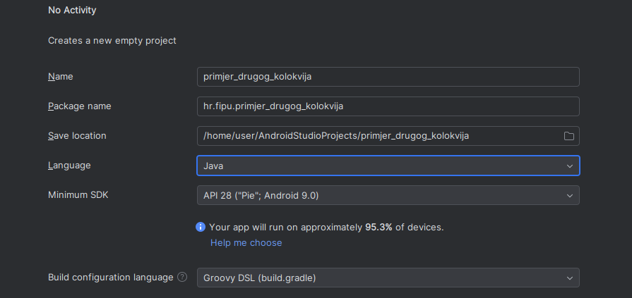
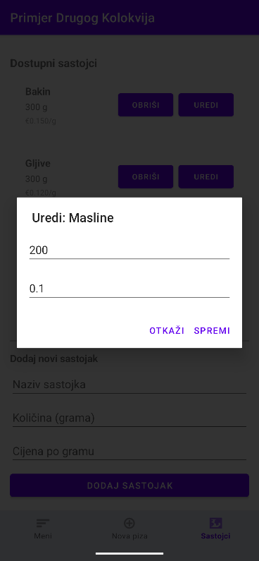
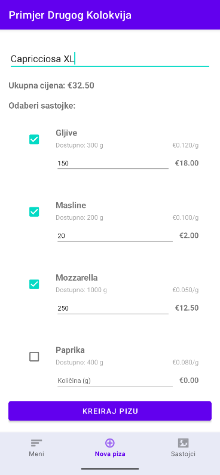

<div>

# Mobilne aplikacije

## Primjer kolokvija #2

Kolokvij nosi ukupno **25 bodova** i piše se **120 minuta**.

Drugi kolokvij se rješava u **jednom Android projektu**. Postavke projekta neka budu:
- Template: **No Activity**
- Project name: **primjer_drugog_kolokvija**
- Package name: **hr.fipu.primjer_drugog_kolokvija**
- Save location: **po želji**
- Language: **Java**
- Minimum SDK: **API 28: (Pie) Android 9.0**
- Build configuration language: **Groovy DSL (build.gradle)**

<div style="width: fit-content; display: flex; flex-direction: column;">
    <div style="display: flex; justify-content: center;">
        
    </div>
    <br/>
    <p style="margin-top: -16px; width: 100%; text-align: center;"><i>Postavke svakog projekta</i></p>
</div>

> **Napomena**: Pri rješavanju zadataka dopušteno je koristiti službenu Android dokumentaciju, materijale s predavanja i internet. Nije dopušteno koristiti generative AI alate (*ChatGPT, DeepSeek, Claude, Grok itd.*).

> **Napomena**: Android Studio ima integrirani **Gemini** AI i njegova uporaba je dopuštena *isključivo* za manje funkcionalnosti poput automatskog dovršavanja koda i sugestija unutar editora. **Nije dopušteno generirati kompletna rješenja zadataka od početka do kraja.**

<div class="page"></div>

## Zadatak 1. (5 bodova) - MainActivity s Fragmentima i Bottom Navigation

Kreirajte `MainActivity` koja koristi **FrameLayout** kao spremnik za fragmente. Aplikacija treba koristiti `BottomNavigationView` s tri stavke za navigaciju između fragmenata:

### Fragmenti i Menu stavke:

1. **HomeFragment** - "Meni"
2. **MakePizzaFragment** - "Nova piza"
3. **AddIngredientsFragment** - "Sastojci"

### Specifikacije:

**MainActivity Layout:**
- Glavni container: `ConstraintLayout`
- `FrameLayout` za fragmente s `id="@+id/fragment_container"`
- `BottomNavigationView` s `id="@+id/bottom_nav"` na dnu zaslona

**BottomNavigationView:**
- Ima tri stavke gdje svaka stavka mora imati ikonicu i tekst:
- Tekst i ikone stavki:
  - "Meni": `ic_menu_sort_by_size`
  - "Nova piza": `ic_menu_add`
  - "Sastojci": `ic_menu_mapmode`

**Fragmenti:**
- `HomeFragment` - prikazuje sve napravljene pizze iz baze podataka
- `MakePizzaFragment` - prikazuje formu za kreiranje nove pizze
- `AddIngredientsFragment` - prikazuje sve dostupne sastojke i mogućnost dodavanja novih

<div class="page"></div>

## Zadatak 2. (8 bodova) - Room Database i Entity Klase

Implementirajte Room bazu podataka.

### Room Entity Klase

#### `IngredientEntity`

Entity klasa koja predstavlja tablicu sastojaka:
- `id` - primarni ključ (*autoGenerate*)
- `name` - naziv sastojka (*obavezno, unique*)
- `quantity` - dostupna količina u gramima
- `pricePerGram` - cijena po gramu

#### `PizzaEntity`

Entity klasa koja predstavlja tablicu pizza:
- `id` - primarni ključ (*autoGenerate*)
- `name` - naziv pizze (*obavezno*)
- `price` - ukupna cijena pizze (*izračunata*)
- `createdDate` - datum kreiranja (*timestamp*)

#### `PizzaIngredientEntity` (relacijska tablica)

Relacijska entity klasa koja povezuje pizze s ingredijentima:
- `id` - primarni ključ (*autoGenerate*)
- `pizzaId` - ID pizze (*foreign key s CASCADE delete*)
- `ingredientId` - ID sastojka (*foreign key s CASCADE delete*)
- `quantityUsed` - količina korištena za ovu pizu (*u gramima*)

### DAO Interface

#### `IngredientDao`

Trebate implementirati sljedeće metode:

- `insert()` - dodavanje novog sastojka
- `update()` - ažuriranje sastojka
- `delete()` - brisanje sastojka
- `getAllIngredients()` - vraća sve sastojke kao `LiveData<List<IngredientEntity>>`
- `getIngredientByName(String name)` - pronalazi sastojak po nazivu
- `getIngredientById(int id)` - pronalazi sastojak po ID-u
- `deleteByName(String name)` - briše sastojak po nazivu

#### `PizzaDao`

Trebate implementirati sljedeće metode:

- `insert()` - dodavanje nove pizze
- `update()` - ažuriranje pizze
- `delete()` - brisanje pizze
- `getAllPizzas()` - vraća sve pizze sortirane po datumu kreiranja (najnovije first) kao `LiveData<List<PizzaEntity>>`
- `getPizzaById(int id)` - pronalazi pizu po ID-u
- `deleteById(int pizzaId)` - briše pizu po ID-u
- `getPizzasByPriceRange(double minPrice, double maxPrice)` - vraća sve pizze u određenom rasponu cijene kao `LiveData<List<PizzaEntity>>`
- `getPizzasByNameContaining(String namePart)` - vraća sve pizze čiji naziv sadrži traženi tekst kao `LiveData<List<PizzaEntity>>`
- `getTotalPriceAllPizzas()` - vraća zbroj cijena svih pizza kao `LiveData<Double>`

#### `PizzaIngredientDao`

Trebate implementirati sljedeće metode:

- `insert()` - dodavanje relacije između pizze i sastojka
- `getIngredientsForPizza(int pizzaId)` - vraća sve sastojke korištene za određenu pizu kao `List<IngredientEntity>`
- `calculatePizzaPrice(int pizzaId)` - izračunava ukupnu cijenu pizze na osnovu sastojaka i njihovih cijena kao `Double`

### Room Database

Kreirajte `AppDatabase` klasu koja nasljeđuje `RoomDatabase`:

- Trebala sadržavati sve tri Entity klase (IngredientEntity, PizzaEntity, PizzaIngredientEntity)
- Version: 1
- Trebaju apstraktne metode koje vraćaju instance svih DAO-a:
  - `ingredientDao()`
  - `pizzaDao()`
  - `pizzaIngredientDao()`

### DatabaseProvider (Singleton)

Kreirajte `DatabaseProvider` klasu koja koristi Singleton pattern:
- Trebala sadržavati statičku instancu baze
- Naziv baze: "pizzeria_database.db"

### Inicijalni Podatci

```
Mozzarella (1000g, 0.05 po gramu)
Paradajz (500g, 0.03 po gramu)
Masline (200g, 0.10 po gramu)
Paprika (400g, 0.08 po gramu)
Gljive (300g, 0.12 po gramu)
Peperoni (200g, 0.20 po gramu)
```

<div class="page"></div>

## Zadatak 3. (12 bodova) - Klase, Fragmenti i Implementacija UI-ja

Kreirajte pomoćne klase za upravljanje pizzerijom i implementirajte sve fragmente s integracijom u Room bazu.

### 1. Pomoćne Plain Old Java Object (POJO) Klase

#### `PizzaIngredientInfo` Klasa - opcionalno

Klasa za prikaz informacija o sastojku korištenom u pizzi:
- `ingredientId` - ID sastojka
- `ingredientName` - naziv sastojka
- `quantityUsed` - količina korištena
- `pricePerGram` - cijena po gramu

#### `Pizzeria` Klasa (*Singleton pattern*)

Klasa koja predstavlja logiku pizzerije (*koristi Room bazu*):

**Metode za upravljanje sastojcima:**
- `addIngredientToDatabase()` - dodaje novi sastojak u bazu (background thread)
- `removeIngredientFromDatabase()` - briše sastojak iz baze
- `getAvailableIngredients()` - vraća sve dostupne sastojke kao LiveData
- `updateIngredientQuantity()` - ažurira količinu sastojka
- `checkIngredientAvailability()` - provjerava ima li dovoljno određenog sastojka

**Metode za upravljanje pizzama:**
- `createPizza()` - kreira novu pizu, sprema je u bazu i ažurira količine sastojaka
- `deletePizza()` - briše pizu iz baze (cascade delete sastojaka)
- `getAllPizzas()` - vraća sve pizze kao LiveData
- `getPizzasByPrice()` - vraća pizze filtrirane po rasponu cijena
- `getPizzasByName()` - vraća pizze filtrirane po naslovu
- `getPizzasCreatedAfter()` - vraća pizze kreirane nakon određenog datuma
- `getTotalRevenue()` - vraća ukupnu sumu svih pizza kao LiveData<Double>

### 2. Fragmenti

#### HomeFragment (*Meni*)

Prikazuje sve napravljene pizze iz baze u RecyclerView:

**Elementi:**
- `RecyclerView` s pizzama
- Svaka stavka pokazuje:
  - Naziv pizze
  - Datum kreiranja
  - Cijena pizze
  - Lista korištenih sastojaka (*s količinama*)
  - Dugme "Obriši"

**Filtriranje (*dodatno*):**
- EditText za pretragu pizza po naslovu
- Dva EditText-a za pretragu pizza po cijenama (*min-max*)

`TextView` koji prikazuje ukupnu cijenu svih pizza

> **Inicijalno:** Lista je prazna, ali se ažurira kada se nove pizze kreiraju

#### MakePizzaFragment (*Nova pizza*)

Omogućuje korisniku da kreira novu pizu:

**Elementi:**
- `EditText` za naziv nove pizze
- `RecyclerView` s dostupnim sastojcima gdje svaki red ima:
  - Naziv sastojka
  - Dostupna količina (*u gramima*)
  - `CheckBox` za odabir sastojka
  - `EditText` za unos željene količine (*samo ako je odabran*)
  - Prikazanu cijenu sastojka za tu količinu
- `TextView` koji prikazuje živu kalkulaciju ukupne cijene pizze
- Dugme "Kreiraj Pizu" koje je:
  - **Aktivno** ako je unesen naziv i barem jedan sastojak s dovoljnom količinom
  - **Deaktivirano** ako nedostaju podaci ili nije označen nijedan sastojak
- `Toast` poruke:
  - Uspješno kreirane pizze
  - Greške ako nema dovoljno sastojaka
  - Validacijske greške

#### AddIngredientsFragment (*Sastojci*)

Omogućuje upravljanje dostupnim sastojcima:

**Elementi:**
- `RecyclerView` s listom svih dostupnih sastojaka gdje svaki red ima:
  - Naziv sastojka
  - Trenutačnu dostupnu količinu (*u gramima*)
  - Cijenu po gramu
  - Dugme "Obriši" (*briše sastojak iz baze*)
  - Dugme "Uredi" (*otvara dialog za ažuriranje*)
- **Dodavanje novog sastojka - forma na dnu ili kao dialog:**
  - `EditText` za naziv
  - `EditText` za početnu količinu
  - `EditText` za cijenu po gramu
  - Dugme "Dodaj" koji:
    - Validira da li naziv već postoji (*ako postoji, prikaži grešku*)
    - Dodaje sastojak u bazu
    - Očisti formu
    - Ažurira RecyclerView

### 3. ViewModel - SharedViewModel

Kreirajte `SharedViewModel` koji omogućava dijeljenje podataka između fragmenata:

- Trebal sadržavati instancu `Pizzeria` klase
- Trebal sadržavati `LiveData` objekte za:
  - Sve pizze
  - Sve sastojke
  - Ukupnu cijenu
- Getteri za LiveData objekte
- Svi fragmenti pristupaju istoj `Pizzeria` instanci kroz `ViewModel`

### 4. Adapteri

#### `PizzaAdapter`
- Prikazuje pizze u RecyclerView
- Trebala imati listener za "Obriši" dugme
- "Obriši" omogućava brisanje pizze

#### `IngredientAdapter`
- Prikazuje sastojke u RecyclerView
- Trebala imati listener za "Obriši" i "Uredi" dugma
  - "Obriši" omogućava brisanje sastojka
  - "Uredi" omogućava ažuriranje količine i cijene

> **Napomena**: Izgled korisničkog sučelja nije strogo definiran, ali treba sadržavati sve tražene elemente i biti funkcionalan

<div class="page"></div>

<div style="width: fit-content; display: flex; flex-direction: column;">
    <div style="display: flex; justify-content: space-between;">
            
            
        </div>
    <br/>
    <p style="margin-top: -16px; width: 100%; text-align: center;"><i>Sastojci Fragment</i></p>
</div>

<div style="width: fit-content; display: flex; flex-direction: column;">
    <div style="display: flex; justify-content: space-between;">
            
            
        </div>
    <br/>
    <p style="margin-top: -16px; width: 100%; text-align: center;"><i>Nova Piza Fragment & Meni Fragment</i></p>
</div>

## Predajte sljedeće:

**Predajte čitav projekt kao `.zip` ili `.rar` datoteku.**

</div>