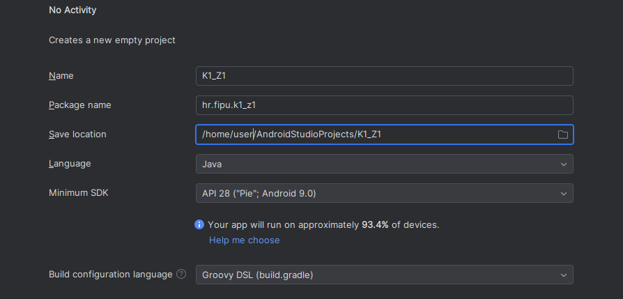
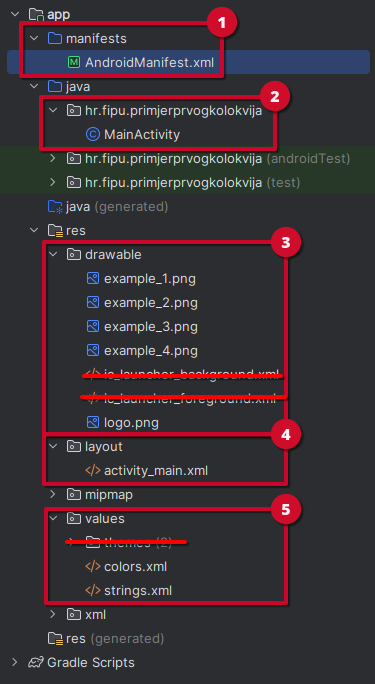

# Mobilne aplikacije

## Upute za pisanje kolokvija

Svaki kolokvij nosi ukupno **25 bodova** i piše se **120 minuta**.

Svaki zadatak rješavate u zasebnom Android projektu. Postavke projekta neka budu:
- Template: **No Activity**
- Project name: **za svaki zadatak zasebno, npr.** `K1_Z1`, `K1_Z2`, `K1_Z3`
- Package name: **hr.fipu.(project_name)**
- Save location: **po želji**
- Language: **Java**
- Minimum SDK: **API 28: (Pie) Android 9.0**
- Build configuration language: **Groovy DSL (build.gradle)**

    

        
    

     
    
<i>Postavke svakog projekta</i>

> **Napomena**: Pri rješavanju zadataka dopušteno je koristiti službenu Android dokumentaciju, materijale s predavanja i internet. Nije dopušteno koristiti generative AI alate (*ChatGPT, DeepSeek, Claude, Grok itd.*).

> **Napomena**: Android Studio ima integrirani **Gemini** AI i njegova uporaba je dopuštena *isključivo* za manje funkcionalnosti poput automatskog dovršavanja koda i sugestija unutar editora. **Nije dopušteno generirati kompletna rješenja zadataka od početka do kraja.**

## Predajete sljedeće:

- Za svaki zadatak zasebno predajete mapu koja sadrži strukturu projekta:
    1. `app/manifests/` - sadrži `AndroidManifest.xml` datoteku
    2. `app/java/direktorij/` - sadrži `.java` datoteke
    3. `app/res/drawable/` - sadrži slike korištene u aplikaciji
    4. `app/res/layout/` - sadrži `.xml` datoteke za layoute
    5. `app/res/values/` - sadrži `colors.xml` & `strings.xml` datoteke

- **Zatim sve zip-ate u jednu datoteku i predajete tu `.zip` datoteku.**

    

        
    

     
    
<i>Primjer mapa i datoteka za predati</i>

> **Napomena**: Svaki zadatak predajete kao zaseban projekt, ne predajete sve zadatke u jednom projektu.

