<div>

# Mobilne Aplikacije

**Nositelj**: doc. dr. sc. Nikola Tanković  
**Izvođač**: dr. sc. Robert Šajina  
**Asistent**: mag. inf. Alesandro Žužić  

**Ustanova**: Sveučilište Jurja Dobrile u Puli, Fakultet informatike u Puli

<p style="float: clear; display: flex; gap: 8px; align-items: center;" class="font-brioni text-sm whitespace-nowrap">
    </img>
    Fakultet informatike u Puli
</p>

# [2] Android studio i uvod u UI elemente

**Posljednje ažurirano:** 13. studenog 2025.

## Sadržaj
<!-- TOC -->
- [Sadržaj](#sadržaj)
- [1. Instalacija](#1-instalacija)
- [2. Kreiranje novog projekta](#2-kreiranje-novog-projekta)
- [3. Struktura projekta i Emulatora](#3-struktura-projekta-i-emulatora)
    - [3.1. Struktura projekta](#31-struktura-projekta)
    - [3.2. Emulator (*AVD - Android Virtual Device*)](#32-emulator-avd---android-virtual-device)
    - [3.3. Postavljanje glavne aktivnosti (*Main Activity*)](#33-postavljanje-glavne-aktivnosti-main-activity)
- [4. Slaganje UI elemenata](#4-slaganje-ui-elemenata)
    - [4.1. Layout Managers](#41-layout-managers)
        - [4.1.1. ConstraintLayout](#411-constraintlayout)
        - [4.1.2. LinearLayout](#412-linearlayout)
        - [4.1.3. RelativeLayout](#413-relativelayout)
    - [4.2. Osnovni UI elementi](#42-osnovni-ui-elementi)
        - [4.2.1. TextView](#421-textview)
        - [4.2.2. Divider](#422-divider)
        - [4.2.3. Button](#423-button)
        - [4.2.4. ImageView](#424-imageview)
        - [4.2.5. EditText](#425-edittext)
- [5. Samostalni zadatak za vježbu](#5-samostalni-zadatak-za-vježbu)
<!-- /TOC -->

<div class="page"></div>

## 1. Instalacija

1. Preuzmi Android Studio s [https://developer.android.com/studio](https://developer.android.com/studio)
2. Pokreni instalaciju i slijedi upute instalacije
3. Prilikom prvog pokretanja, Android Studio će automatski preuzeti potrebne **SDK komponente**- (*Software Development Kit*).
   - Ako se pojavi dijalog s pitanjem "Install missing SDK components" - potvrdi instalaciju
4. Nakon što je instalacija gotova, otvori **New Project**.

---

## 2. Kreiranje novog projekta

Kada stvaramo novi projekt, treba odabrati **template**. 

<div style="width: fit-content; display: flex; flex-direction: column;">
    <div style="display: flex; justify-content: center;">
        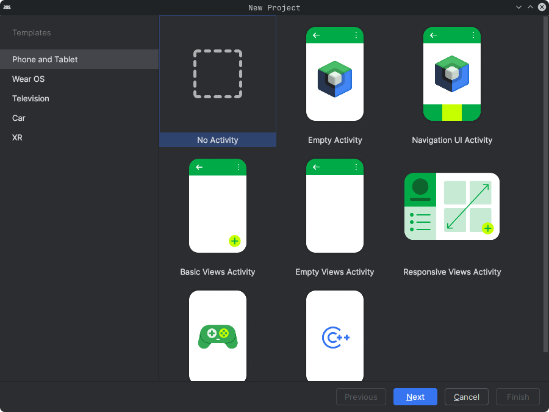
    </div>
    <br/>
    <p style="margin-top: -16px; width: 100%; text-align: center;"><i>No Activity - Template</i></p>
</div>

> Za svrhe vježbi koristit ćemo *No Activity* template.

Kod stvaranja novog projekta pojavit će se nekoliko važnih polja i postavki:

<div style="width: fit-content; display: flex; flex-direction: column;">
    <div style="display: flex; justify-content: center;">
        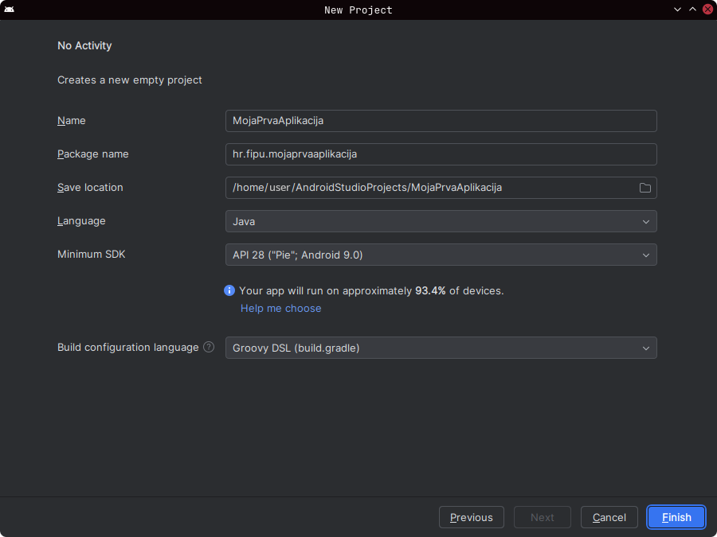
    </div>
    <br/>
    <p style="margin-top: -16px; width: 100%; text-align: center;"><i>Postavke novog projekta</i></p>
</div>

- **Name**
  Naziv projekta koji će se prikazivati u Android Studiju i unutar aplikacije.
  - Primjer: `MojaPrvaAplikacija`
  - Ovaj naziv ne mora biti isti kao naziv aplikacije vidljiv korisniku - to se kasnije definira u `res/values/strings.xml`.

- **Package name**
  Jedinstveni identifikator aplikacije u Google Play Storeu i Android sustavu.
  - Obično u obliku: `hr.fipu.mojaprvaaplikacija`
  - Mora biti jedinstven, jer ga Google koristi za razlikovanje aplikacija.
  - Preporuka: koristi naziv ustanove/domena unatrag + ime projekta

- **Save location**
  Lokacija na disku gdje će Android Studio spremiti projektne datoteke.
  - Primjer: `C:\Users\Username\AndroidStudioProjects\MojaPrvaAplikacija`
  - Preporuka: koristi mapu bez razmaka i dijakritičkih znakova u imenu

- **Language**
  Programski jezik u kojem će se razvijati aplikacija.
  - **Kotlin (default)** - preporučeni jezik za moderni Android razvoj (*Google službeno podržava*)
  - **Java** - stariji, ali još uvijek široko korišten

> Za svrhe vježbi koristit ćemo *Java* programski jezik

- **Minimum SDK**
  Najniža verzija Android operativnog sustava koju aplikacija podržava.
  - Određuje koliko starim uređajima aplikacija može raditi
  - Primjer: **API 28: Android 9.0 (Pie)**
  - Android Studio prikazuje koliki postotak aktivnih uređaja podržava odabrani API
  - Što niži API - više uređaja podržano, ali manje novijih značajki

> Za svrhe vježbi koristit ćemo *SDK - API 28: Android 9.0 (Pie)*

- **Build configuration language**
  Određuje u kojem će jeziku biti konfiguracijske datoteke za build proces.
  - Opcije:
    - **Groovy DSL** - klasični format `build.gradle` datoteka
    - **Kotlin DSL (default)** - moderniji pristup (`build.gradle.kts`) s boljom integracijom u Kotlin projekte

> Za svrhe vježbi koristit ćemo *Groovy DSL*

Kada smo postavili sve opcije, kliknemo **Finish** za kreiranje projekta. Projekt će se generirati i otvoriti u Android Studiju. Potrebno je sačekati nekoliko minuta dok se svi potrebni resursi i ovisnosti preuzmu i konfiguriraju.

U gornjem desnom kutu nalazi se padajući izbornik za prikaz strukture projekta. Ako nije odabran prikaz "Android" inbda je odaberite.

<div style="width: fit-content; display: flex; flex-direction: column;">
    <div style="display: flex; justify-content: center;">
        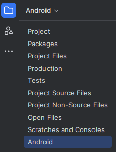
    </div>
    <br/>
    <p style="margin-top: -16px; width: 100%; text-align: center;"><i>Android prikaz strukture projekta</i></p>
</div>

<br>

<div class="page"></div>

## 3. Struktura projekta i Emulatora

Nakon što se projekt kreira, Android Studio automatski otvori glavni prozor s pregledom strukture projekta.

### 3.1. Struktura projekta

<div style="width: fit-content; display: flex; flex-direction: column;">
    <div style="display: flex; justify-content: center;">
        
    </div>
    <br/>
    <p style="margin-top: -16px; width: 100%; text-align: center;"><i>Struktura projekta</i></p>
</div>

- **app/java** - sadrži izvorni kôd aplikacije
- **app/res** - sadrži resurse aplikacije (*slike, tekstove, boje, layout datoteke*)
- **app/manifests** - sadrži `AndroidManifest.xml`, datoteku s osnovnim informacijama o aplikaciji
- **Gradle Scripts** - build konfiguracije projekta i modula

### 3.2. Emulator (*AVD - Android Virtual Device*)

Emulator služi za testiranje aplikacije bez fizičkog uređaja. Ako nema postavljenog emulatora potrebno je napraviti sljedeće korake:
  1. Otvori **Device Manager** (*gumb u gornjoj alatnoj traci*)
  2. Klikni **Create Device**
  3. Odaberi željeni uređaj (*npr. Pixel 7*)
  4. Odaberi verziju Android sustava (*npr. Android 13 - API 33*)
  5. Klikni **Download** i pričekaj instalaciju slike sustava
  6. Klikni **Finish**
  7. Pokreni emulator pritiskom na **Play (▶)**

> Pri instalaciji nove verzije Android Studia automatski se postavi emulator pa ga možemo odmah pokrenuti  bez postavljanja

<div style="width: fit-content; display: flex; flex-direction: column;">
    <div style="display: flex; justify-content: center;">
        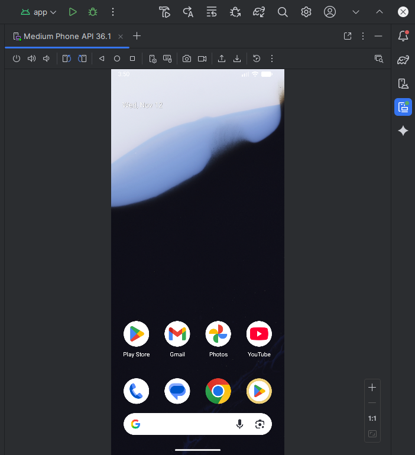
    </div>
    <br/>
    <p style="margin-top: -16px; width: 100%; text-align: center;"><i>Emulator</i></p>
</div>

Kada se emulator pokrene, Android Studio će ga automatski povezati s tvojim projektom i omogućiti pokretanje aplikacije klikom na **Run (Shift + F10)**.

### 3.3. Postavljanje glavne aktivnosti (*Main Activity*)

S obzirom da radimo s *No Avtivity* predloškom (*template*) koji nema nijedna glavna aktivnost (**Main Activity**). Potrebno ga je ručno dodati i namjestiti, inače ako pokušamo pokrenuti projekt dobit ćemo grešku da ne postoji zadana aktivnost:

<div style="width: fit-content; display: flex; flex-direction: column;">
    <div style="display: flex; justify-content: center;">
        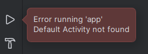
    </div>
    <br/>
    <p style="margin-top: -16px; width: 100%; text-align: center;"><i>Greška pri pokretanju aplikacije - ne postoji zadana aktivnost</i></p>
</div>

Tako da ćemo u direktoriju *java* u *paketu imena projekta* kreirati novi **Empty Views Activity**:

<div style="width: fit-content; display: flex; flex-direction: column;">
    <div style="display: flex; justify-content: center;">
        
    </div>
    <br/>
    <p style="margin-top: -16px; width: 100%; text-align: center;"><i>Empty Views Activity</i></p>
</div>

<div style="width: fit-content; display: flex; flex-direction: column;">
    <div style="display: flex; justify-content: center;">
        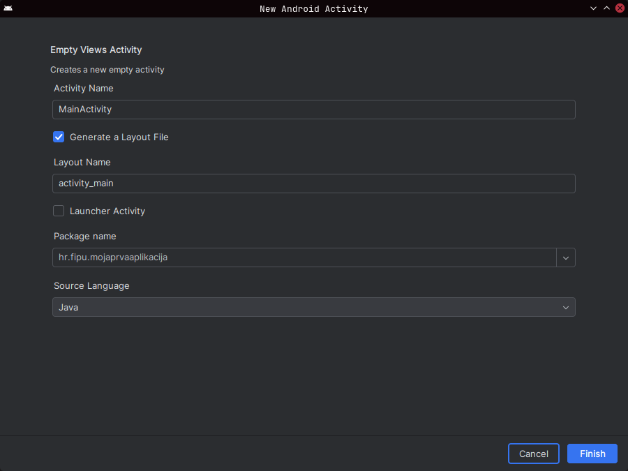
    </div>
    <br/>
    <p style="margin-top: -16px; width: 100%; text-align: center;"><i>Postavke nove Empty Views Activity</i></p>
</div>

Pustit ćemo zadane postavke koje će kreirati `MainActivity.java` i `activity_main.xml` u *layout* mapi unutar *res* direktorija. Te nadodati `<activity>` element u `AndroidManifest.xml`. 

<div style="width: fit-content; display: flex; flex-direction: column;">
    <div style="display: flex; justify-content: center;">
        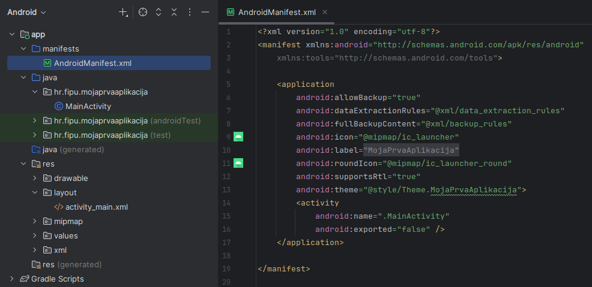
    </div>
    <br/>
    <p style="margin-top: -16px; width: 100%; text-align: center;"><i>Android Manifest</i></p>
</div>

Sada je potrebno ažurirati `AndroidManifest.xml` da koristi novododani `MainActivity.java` kao zadanu aktivnost. Tako da:
  1. Stavimo `exported` atribut na `true`
  2. Dodamo `<intent-filter>` element unutar `<activity>` element, unutar njega dodamo:
  3. `<action/>` element, s `name` atributom s vrijednošću `android.intent.action.MAIN` 
  4. `<category/>` element, s `name` atributom s vrijednošću `"android.intent.category.LAUNCHER` 

```xml
<?xml version="1.0" encoding="utf-8"?>
<manifest xmlns:android="http://schemas.android.com/apk/res/android">

    <application
        android:allowBackup="true"
        android:dataExtractionRules="@xml/data_extraction_rules"
        android:fullBackupContent="@xml/backup_rules"
        android:icon="@mipmap/ic_launcher"
        android:label="@string/app_name"
        android:roundIcon="@mipmap/ic_launcher_round"
        android:supportsRtl="true"
        android:theme="@style/Theme.MojaPrvaAplikacija">
        <activity
            android:name=".MainActivity"
            android:exported="true" >
            <intent-filter>
                <action android:name="android.intent.action.MAIN" />
                <category android:name="android.intent.category.LAUNCHER" />
            </intent-filter>
        </activity>
    </application>

</manifest>
```

Sada možemo pokrenuti projekt. Kliknemo *play* dugme (*Run App*, `Shift+F10`) na gornjoj traci:

<div style="width: fit-content; display: flex; flex-direction: column;">
    <div style="display: flex; justify-content: center;">
        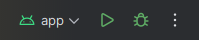
    </div>
    <br/>
    <p style="margin-top: -16px; width: 100%; text-align: center;"><i>Pokretanje projekta</i></p>
</div>

I s desnog bočnog izbornika otvorimo pregled emulatora (*Running Devices*):

<div style="width: fit-content; display: flex; flex-direction: column;">
    <div style="display: flex; justify-content: center;">
        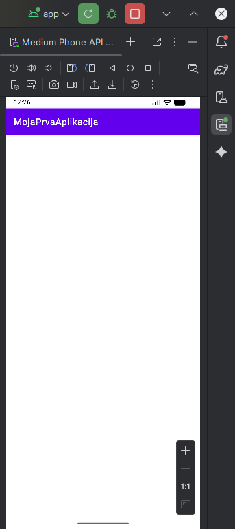
    </div>
    <br/>
    <p style="margin-top: -16px; width: 100%; text-align: center;"><i>Pregled emulatora</i></p>
</div>

## 4. Slaganje UI elemenata

Sada kada imamo postavljen projekt i glavnu aktivnost, možemo krenuti sa slaganjem UI elemenata u `activity_main.xml` datoteci.

Kada je odaberemo u *res/layout* direktoriju, otvorit će se **Layout Editor** koji omogućava vizualno slaganje elemenata.

<div style="width: fit-content; display: flex; flex-direction: column;">
    <div style="display: flex; justify-content: center;">
        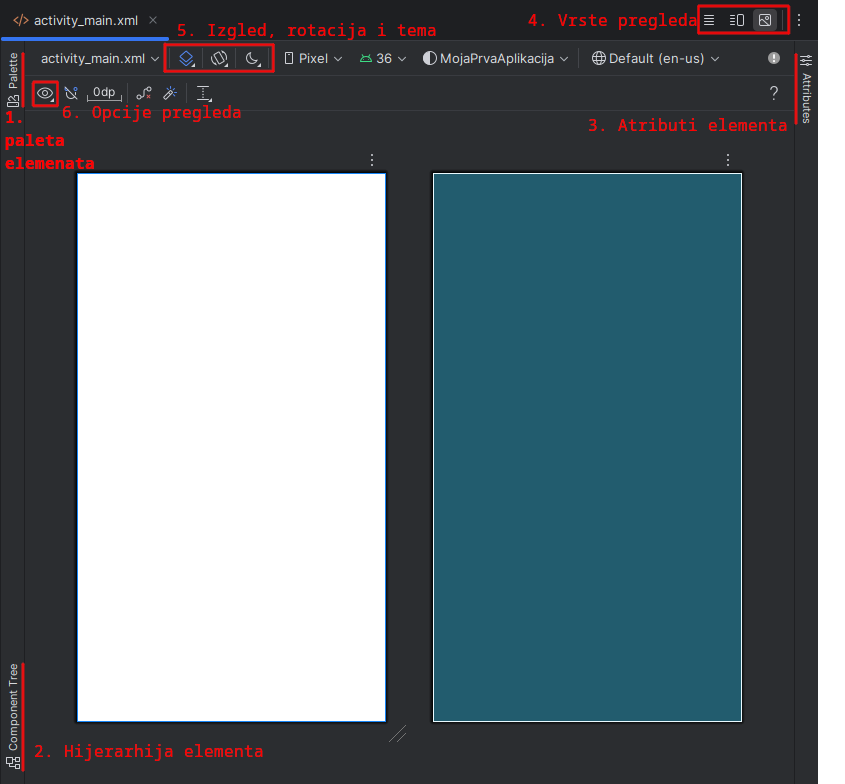
    </div>
    <br/>
    <p style="margin-top: -16px; width: 100%; text-align: center;"><i>Zadani pregled XML-a</i></p>
</div>

Na slici imamo 6 izbornika oko Layout Editora:
1. **Paleta elemenata** - sadrži UI elemente koje možemo povući i ispustiti u dizajn
2. **Component Tree** - prikazuje hijerarhiju UI elemenata u layoutu
3. **Atributi elementa** - omogućava uređivanje svojstava odabranog UI elementa
4. **Vrste pregleda**:
   - *Design* - vizualni prikaz layouta
   - *Code* - XML kôd layouta
   - *Split* - kombinirani prikaz
5. **Izgled, rotacija i tema**:
  - *Design surface* - izbor načina prikaza platna:
    - *Design* - grafički prikaz s elementima
    - *Blueprint* - shematski prikaz (okviri i mjere)
    - *Split* - istovremeni prikaz *Design* i *Code*
  - *Orientation* - promjena orijentacije uređaja (portrait / landscape)
  - *Night mode* - simulacija tamnog načina rada (pregled izgleda aplikacije u dark theme)
6. **Opcije pregleda** - prikaz/skrivanje sistemskih traka i drugih elemenata uređaja

> Koristit ćemo **Design** prikaz za vizualno slaganje elemenata iz Palete elemenata.

<div style="width: fit-content; display: flex; flex-direction: column;">
    <div style="display: flex; justify-content: center;">
        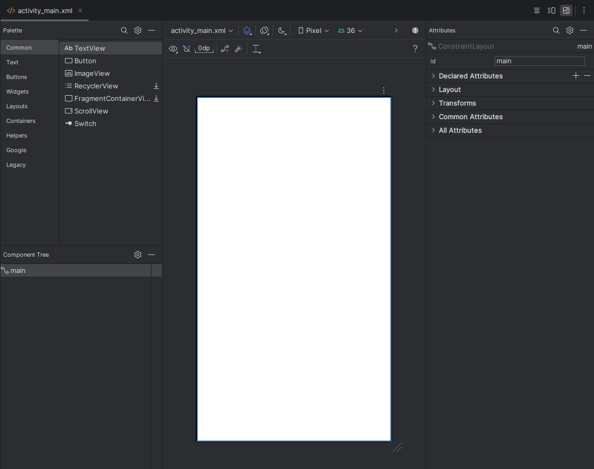
    </div>
    <br/>
    <p style="margin-top: -16px; width: 100%; text-align: center;"><i>Design pregled</i></p>
</div>

Na slici iznad vidimo kako izgleda početni *Design* prikaz s jednim **main** elementom u Component Tree-u - **ConstraintLayout**, također u *Atributima* elementa možemo vidjeti svojstva odabranog **ConstraintLayout** elementa.  Moguće ga je zamijeniti s drugim *layout managerima* poput **LinearLayout** ili **RelativeLayout** ovisno o potrebama dizajna.

### 4.1. Layout Managers

U sljedećem poglavlju isprobati ćemo različite vrste *layout managera* i slagati osnovne UI elemente poput **TextView**, **Button**, **ImageView** i drugih.
#### 4.1.1. ConstraintLayout

**ConstraintLayout** omogućava precizno pozicioniranje UI elemenata pomoću ograničenja (*constraints*). Ograničenja definiraju odnose između elemenata i njihovih roditeljskih elemenata, omogućavajući dinamično prilagođavanje izgleda na različitim veličinama ekrana.

Ako potegnemo Button element iz Palete elemenata u Design površinu, vidjet ćemo da se pojavljuje nekoliko plavih krugova oko elementa. To su *handles* za postavljanje ograničenja.

<div style="width: fit-content; display: flex; flex-direction: column;">
    <div style="display: flex; justify-content: center;">
        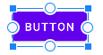
    </div>
    <br/>
    <p style="margin-top: -16px; width: 100%; text-align: center;"><i>Button element s ručkama za ograničenja</i></p>
</div>

Sada možemo povući te ručke do drugih elemenata ili rubova roditeljskog **ConstraintLayout** kako bismo definirali odnose. Na primjer, možemo povući gornju ručku do vrha roditeljskog elementa kako bismo postavili gornje ograničenje. Isto tako možemo postaviti lijevo, desno i donje ograničenje.

<div style="width: fit-content; display: flex; flex-direction: column;">
    <div style="display: flex; justify-content: center;">
        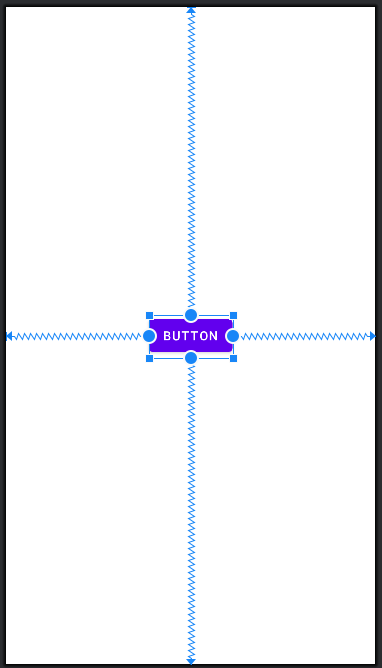
    </div>
    <br/>
    <p style="margin-top: -16px; width: 100%; text-align: center;"><i>Button element s postavljenim ograničenjima</i></p>
</div>

Taj button možemo dodatno pozicionirati pomoću atributa u *Atributima elementa* kod Layout atributa koristeći GUI sučelje za pozicioniranje ili ručno upisujući vrijednosti u input polja.

<div style="width: fit-content; display: flex; flex-direction: column;">
    <div style="display: flex; justify-content: center;">
        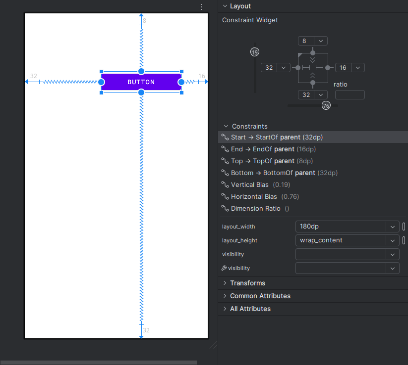
    </div>
    <br/>
    <p style="margin-top: -16px; width: 100%; text-align: center;"><i>Button element mjenjanje vrijednosti Layout atributa</i></p>
</div>

Ako imamo više elemenata, možemo ih povezati međusobno postavljanjem ograničenja između njih. Na primjer, možemo postaviti ograničenje između 3 **Button** elementa kako bi bili ravnomjerno raspoređeni jedan do drugog.

Za to možemo koristiti opcije **Pack** i **Align** u gornjem izborniku Layout Editora:
- **Pack** - grupira, širi i distribuira odabrane elemente zajedno
- **Align** - poravnava odabrane elemente

<div style="width: fit-content; display: flex; flex-direction: column;">
    <div style="display: flex; justify-content: center;">
        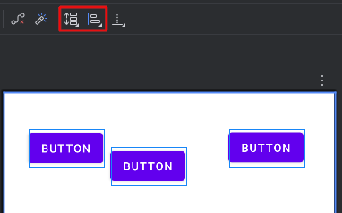
    </div>
    <br/>
    <p style="margin-top: -16px; width: 100%; text-align: center;"><i>Poravnavanje button elemenata</i></p>
</div>

Zatim ih možemo poravnat pomoću **Align** opcije, npr. *Horizontally* i *Vertically*, pomaknut prema gore. Te namjestiti **Chain** stil na *Spread* kako bi bili ravnomjerno raspoređeni.

<div style="width: fit-content; display: flex; flex-direction: column;">
    <div style="display: flex; justify-content: center;">
        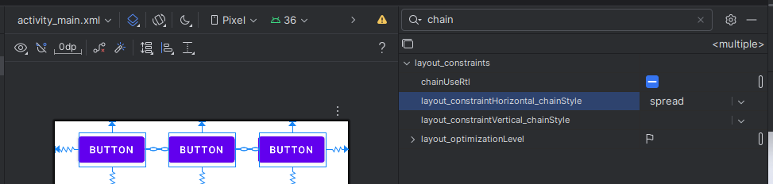
    </div>
    <br/>
    <p style="margin-top: -16px; width: 100%; text-align: center;"><i>Aling & Chain</i></p>
</div>

Sada imamo tri button elementa ravnomjerno raspoređena unutar **ConstraintLayout** roditeljskog elementa.

#### 4.1.2. LinearLayout

**LinearLayout** organizira UI elemente u linearni redoslijed, bilo horizontalno ili vertikalno. Svaki element se postavlja jedan za drugim, a orijentacija se definira pomoću atributa `orientation`.

Da bi promijenili **ConstraintLayout** u **LinearLayout**, potrebno je desnim klikom na **ConstraintLayout** u *Component Tree* odabrati opciju **Convert view...** i zatim odabrati **LinearLayout** iz ponuđenih opcija.

<div style="width: fit-content; display: flex; flex-direction: column;">
    <div style="display: flex; justify-content: center;">
        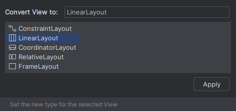
    </div>
    <br/>
    <p style="margin-top: -16px; width: 100%; text-align: center;"><i>Convert view</i></p>
</div>

Sada možemo postaviti orijentaciju **LinearLayout** elementa u *Atributima elementa* na *vertical* ili *horizontal*.

> U primjeru ćemo postaviti na *horizontal*.

Zatim možemo povući nekoliko **Button** elemenata iz *Palete elemenata* u *Design* površinu. Vidjet ćemo da se automatski postavljaju jedan do drugog u horizontalnom smjeru.

<div style="width: fit-content; display: flex; flex-direction: column;">
    <div style="display: flex; justify-content: center;">
        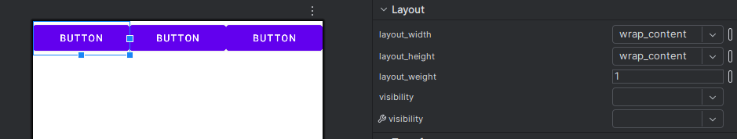
    </div>
    <br/>
    <p style="margin-top: -16px; width: 100%; text-align: center;"><i>Linear Layout</i></p>
</div>

Možemo uočiti da su svi button elementi zbijeni jedan do drugog. To možemo riješiti postavljanjem **layout_margin** atributa za svaki button element u *Atributima elementa*. Na primjer, možemo postaviti marginu od `8dp` sa svih strana.

<div style="width: fit-content; display: flex; flex-direction: column;">
    <div style="display: flex; justify-content: center;">
        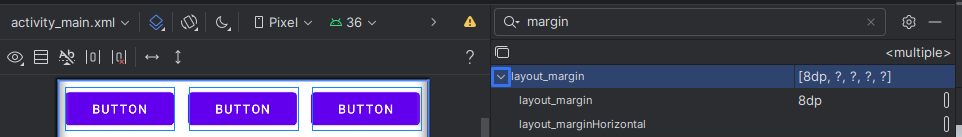
    </div>
    <br/>
    <p style="margin-top: -16px; width: 100%; text-align: center;"><i>Layout Margin</i></p>
</div>

Ako pokušamo smanjiti jedan od button elemenata, vidjet ćemo da se ostali elementi povećavaju. To je zbog toga što je zadani **layout_width** atribut postavljen na `0dp` s **layout_weight** atributom postavljenim na `1`. To znači da svi elementi dijele raspoloživi prostor ravnomjerno.

Ako promijenimo **layout-weight** atribut na `0` za sve button elemente, tada će se širina elemenata prilagoditi njihovom sadržaju.

<div style="width: fit-content; display: flex; flex-direction: column;">
    <div style="display: flex; justify-content: center;">
        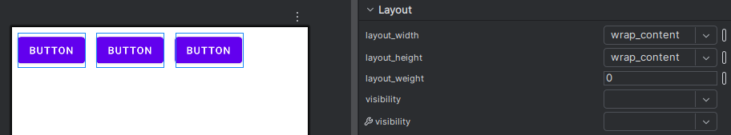
    </div>
    <br/>
    <p style="margin-top: -16px; width: 100%; text-align: center;"><i>Layout Weight</i></p>
</div>

Da bi sada elemente poravnali u sredinu roditeljskog elementa, možemo postaviti **gravity** atribut na *center|top* u *Atributima elementa* za **LinearLayout** roditeljski element.

<div style="width: fit-content; display: flex; flex-direction: column;">
    <div style="display: flex; justify-content: center;">
        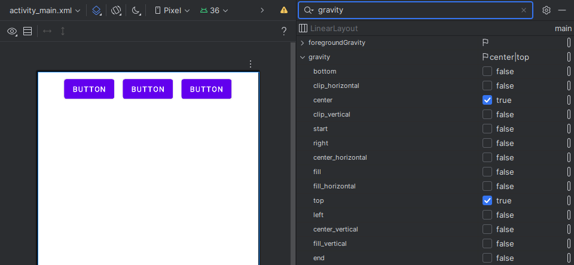
    </div>
    <br/>
    <p style="margin-top: -16px; width: 100%; text-align: center;"><i>Gravity</i></p>
</div>

#### 4.1.3. RelativeLayout

**RelativeLayout** omogućava pozicioniranje UI elemenata u odnosu na druge elemente ili roditeljski element. Svaki element može imati odnose definirane pomoću atributa:
- `layout_above` - postavlja element iznad drugog elementa
- `layout_below` - postavlja element ispod drugog elementa
- `layout_toLeftOf` - postavlja element lijevo od drugog elementa
- `layout_toRightOf` - postavlja element desno od drugog elementa
- `layout_alignParentTop` - poravnava element s vrhom roditeljskog element
- `layout_alignParentBottom` - poravnava element s dnom roditeljskog elementa
- `layout_alignParentLeft` - poravnava element s lijevom stranom roditeljskog elementa
- `layout_alignParentRight` - poravnava element s desnom stranom roditeljskog elementa

Ako dodamo jedan **Button** element u **RelativeLayout**, možemo ga pozicionirati u odnosu na roditeljski element.

<div style="width: fit-content; display: flex; flex-direction: column;">
    <div style="display: flex; justify-content: center;">
        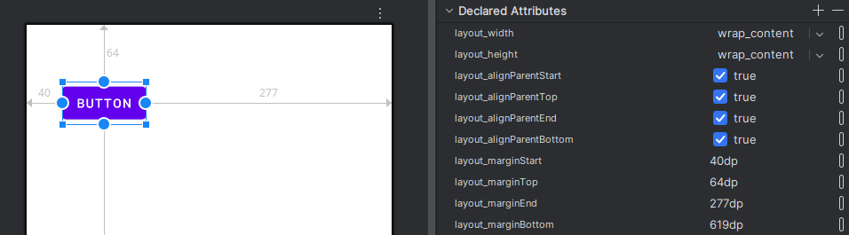
    </div>
    <br/>
    <p style="margin-top: -16px; width: 100%; text-align: center;"><i>Relative Layout</i></p>
</div>

Ako dodamo druge **Button** elemente, možemo ih pozicionirati u odnosu na prvi element koristeći gore navedene atribute.

<div style="width: fit-content; display: flex; flex-direction: column;">
    <div style="display: flex; justify-content: center;">
        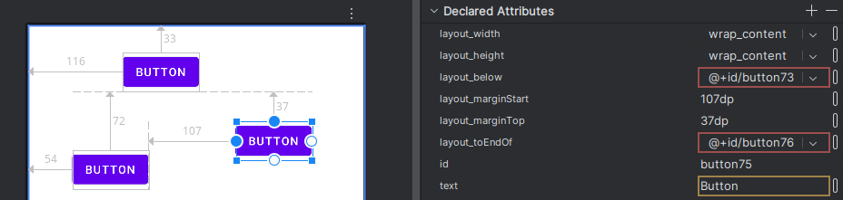
    </div>
    <br/>
    <p style="margin-top: -16px; width: 100%; text-align: center;"><i>Relative button elements</i></p>
</div>

Ovim pristupom možemo precizno kontrolirati pozicioniranje elemenata unutar **RelativeLayout** roditeljskog elementa. Međutim, treba biti oprezan s previše složenih odnosa jer to može dovesti do problema s performansama i održavanjem koda.

> Napomena: distribucija elemenata nije toliko jednostavna kao kod **ConstraintLayout** ili **LinearLayout**, pa je preporučljivo koristiti **RelativeLayout** samo kada je potrebno specifično pozicioniranje elemenata u odnosu na druge.

### 4.2. Osnovni UI elementi

U sljedećim poglavljima proći ćemo osnovne UI elemente poput **TextView**, **Divider**, **Button**, **ImageView**, **EditText** i drugih unutar *constraint layouta*.

#### 4.2.1. TextView

**TextView** je osnovni UI element za prikaz teksta u Android aplikacijama. Može se koristiti za naslove, opise, upute i druge tekstualne informacije.

<div style="width: fit-content; display: flex; flex-direction: column;">
    <div style="display: flex; justify-content: center;">
        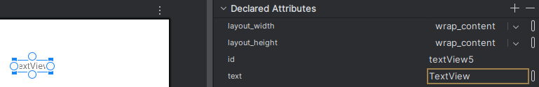
    </div>
    <br/>
    <p style="margin-top: -16px; width: 100%; text-align: center;"><i>Text View element</i></p>
</div>

Možemo prilagoditi svojstva **TextView** elementa u *Atributima elementa*, poput:
- `text` - postavlja prikazani tekst
- `textSize` - postavlja veličinu teksta
- `textColor` - postavlja boju teksta
- `fontFamily` - postavlja font teksta
- `gravity` - postavlja poravnanje teksta unutar elementa
- `textStyle` — podebljano/kurziv (`bold`, `italic`, `normal`)
- `lines` — fiksan broj redaka
- `ellipsize` — skraćivanje teksta (`end`, `start`, `middle`, `marquee`)
- `includeFontPadding` — uklanja/ostavlja zadani font padding

<div style="width: fit-content; display: flex; flex-direction: column;">
    <div style="display: flex; justify-content: center;">
        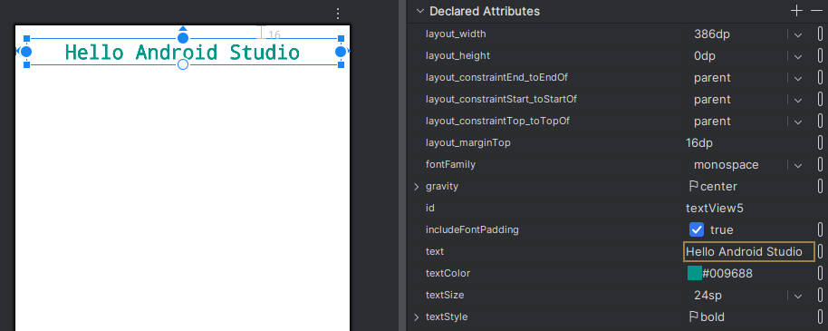
    </div>
    <br/>
    <p style="margin-top: -16px; width: 100%; text-align: center;"><i>Text View atributi</i></p>
</div>

#### 4.2.2. Divider

**Divider** je jednostavan horizontalni ili vertikalni linijski element koji se koristi za vizualno odvajanje sadržaja unutar korisničkog sučelja. Često se koristi za razdvajanje različitih sekcija ili grupa elemenata.

- Nalazi se u *Paleti elemenata* pod kategorijom **Widgets**

Možemo prilagoditi svojstva **Divider** elementa u *Atributima elementa*, poput:
- `layout_width` i `layout_height` - postavlja dimenzije dividera
- `background` - postavlja boju ili stil pozadine dividera
- `margin` - postavlja margine oko dividera

<div style="width: fit-content; display: flex; flex-direction: column;">
    <div style="display: flex; justify-content: center;">
        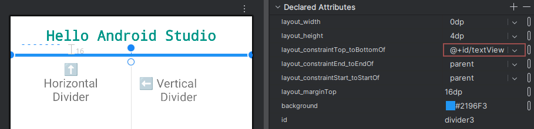
    </div>
    <br/>
    <p style="margin-top: -16px; width: 100%; text-align: center;"><i>Divider elementi</i></p>
</div>

#### 4.2.3. Button

**Button** je interaktivni UI element koji korisnicima omogućava izvršavanje akcija pritiskom na njega. Može se koristiti za slanje podataka, navigaciju između zaslona ili pokretanje funkcija unutar aplikacije.

<div style="width: fit-content; display: flex; flex-direction: column;">
    <div style="display: flex; justify-content: center;">
        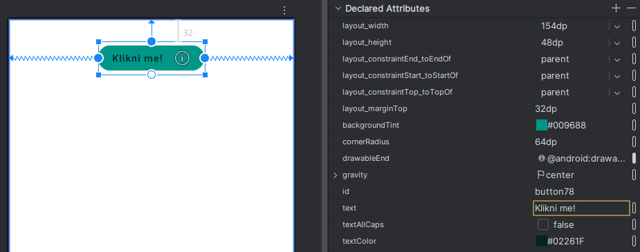
    </div>
    <br/>
    <p style="margin-top: -16px; width: 100%; text-align: center;"><i>Button element</i></p>
</div>

Možemo prilagoditi svojstva **Button** elementa u *Atributima elementa*, poput:
- `backgroundTint` - postavlja boju pozadine gumba
- `cornerRadius` - postavlja zaobljenje kutova gumba
- `text` - postavlja prikazani tekst na gumbu
- `textColor` - postavlja boju teksta na gumbu
- `fontFamily` - postavlja font teksta na gumbu
- `textStyle` — podebljano/kurziv (`bold`, `italic`, `normal`)
- `allCaps` - postavlja tekst na gumbu da bude velikim slovima (true/false)
- `gravity` - postavlja poravnanje teksta unutar gumba
- `drawable` - postavlja ikonu na gumb

#### 4.2.4. ImageView

**ImageView** je UI element koji se koristi za prikazivanje slika unutar aplikacije, tako da ubacimo sliku u *res/drawable* direktorij.

<div style="width: fit-content; display: flex; flex-direction: column;">
    <div style="display: flex; justify-content: center;">
        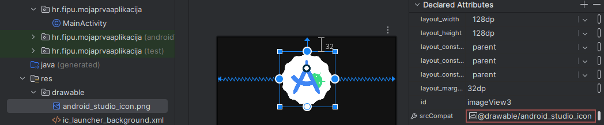
    </div>
    <br/>
    <p style="margin-top: -16px; width: 100%; text-align: center;"><i>Image element</i></p>
</div>

#### 4.2.5. EditText

**EditText** je UI element koji omogućava korisnicima unos teksta unutar aplikacije. Može se koristiti za unos podataka, pretraživanje ili bilo koju drugu funkciju koja zahtijeva tekstualni unos.

Postoje različite vrste **EditText** elemenata, poput:
- Plain Text
- Password
- Email
- Number
- Phone
- Date
- Multiline Text
- ...i drugi

Možemo prilagoditi svojstva **EditText** elementa u *Atributima elementa*, poput:
- `hint` - postavlja tekst koji se prikazuje kada je polje prazno
- `inputType` - definira vrstu unosa (tekst, broj, email, lozinka, itd.)
- `maxLength` - postavlja maksimalan broj znakova koji se mogu unijeti

<div style="width: fit-content; display: flex; flex-direction: column;">
    <div style="display: flex; justify-content: center;">
        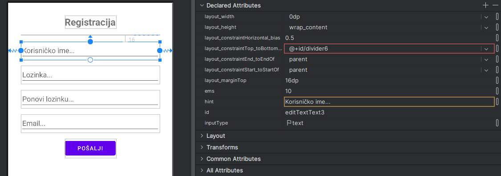
    </div>
    <br/>
    <p style="margin-top: -16px; width: 100%; text-align: center;"><i>Edit Text element</i></p>
</div>

<div class="page"></div>

## 5. Samostalni zadatak za vježbu

Rekreirajte sljedeći izgled korisničkog sučelja koristeći naučene UI elemente i *layout managere*:

<div style="width: fit-content; display: flex; flex-direction: column;">
    <div style="display: flex; justify-content: center;">
        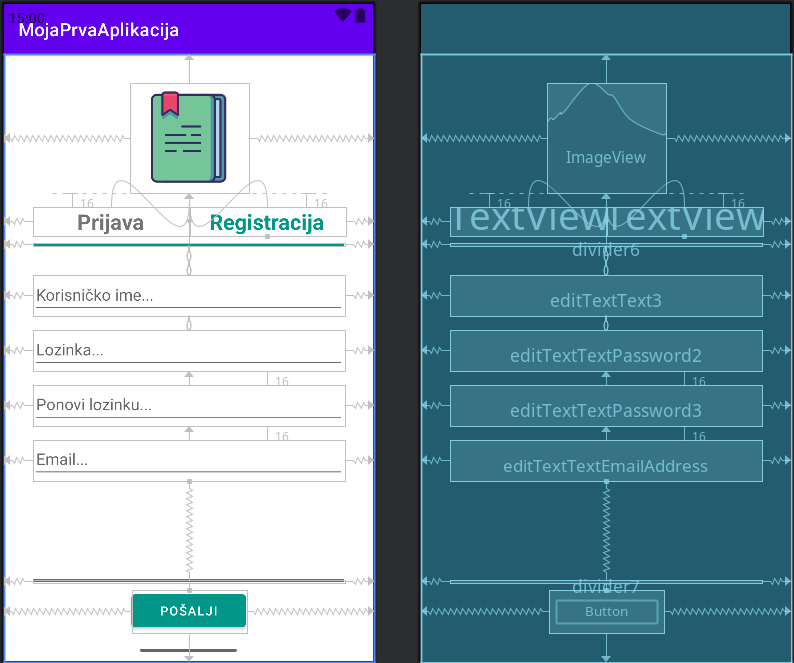
    </div>
    <br/>
    <p style="margin-top: -16px; width: 100%; text-align: center;"><i>Zadatak</i></p>
</div>

</div>