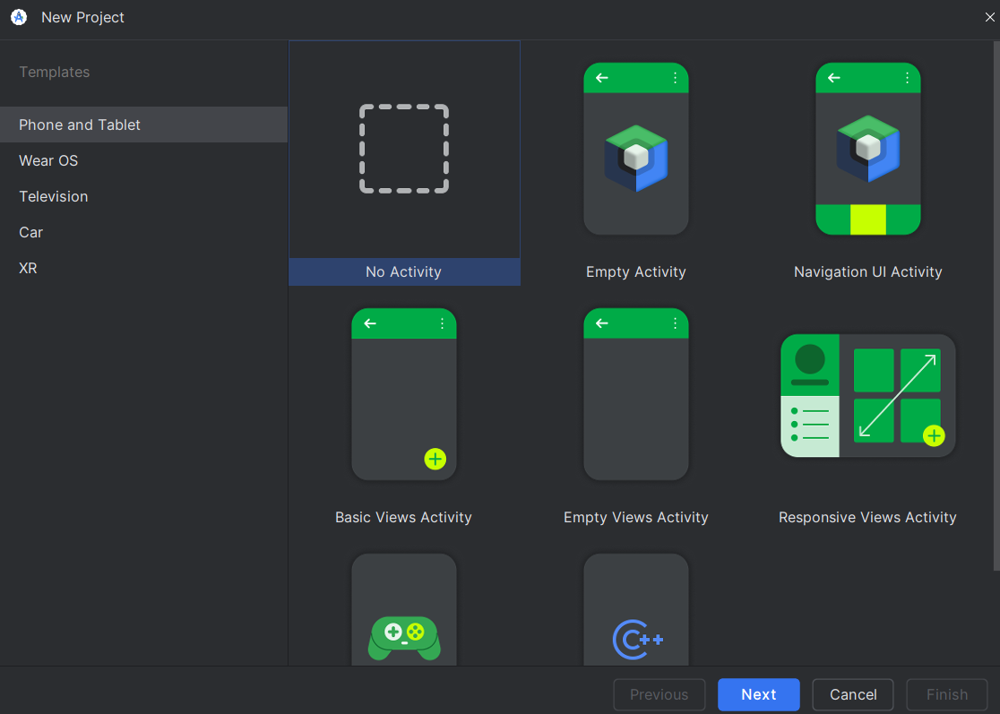
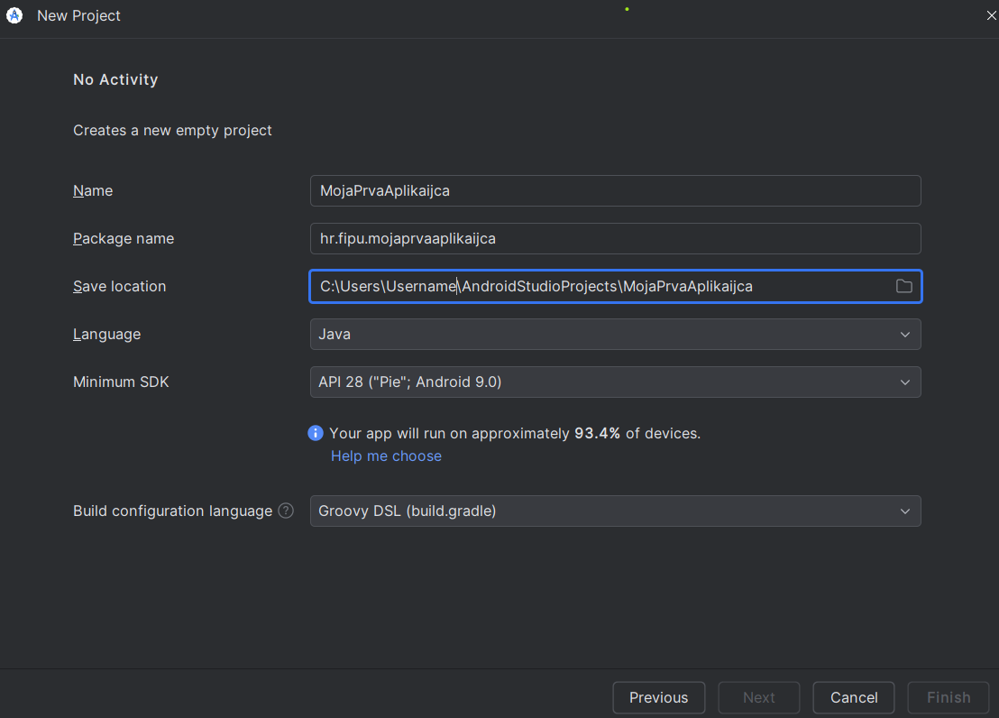
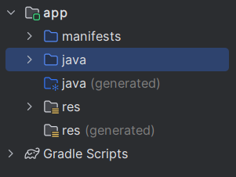
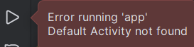
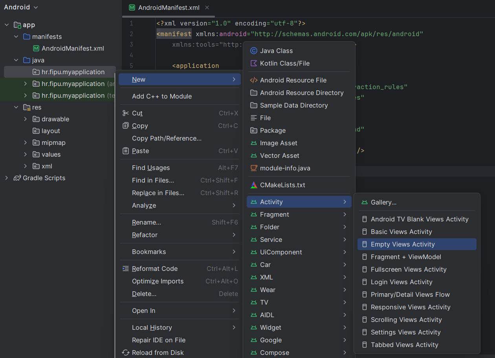
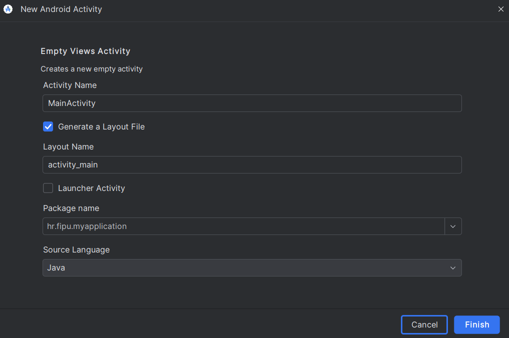
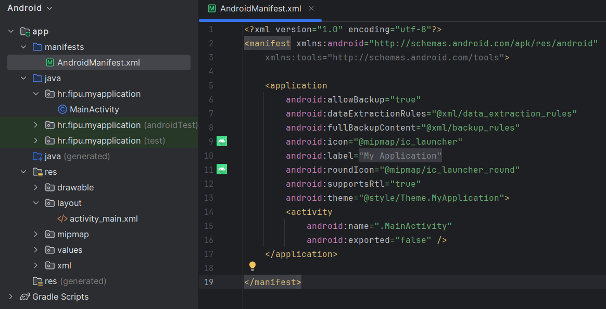
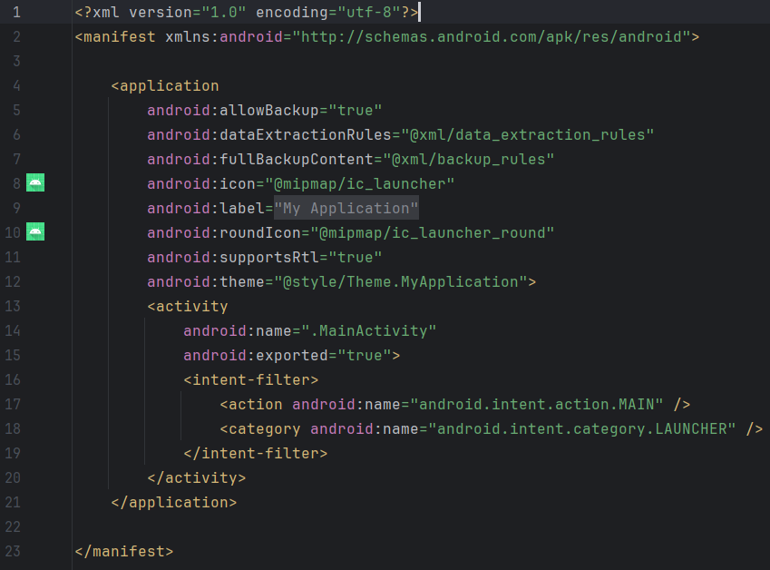
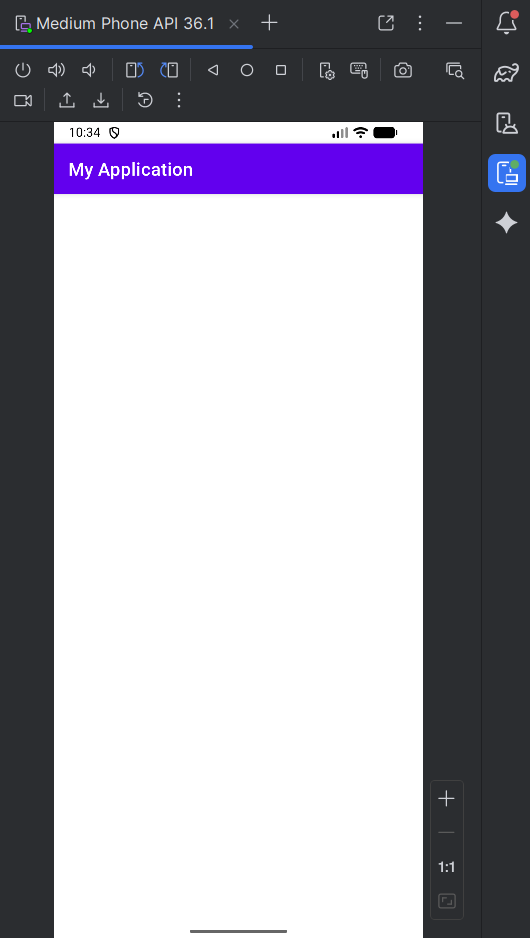

# Mobilne Aplikacije

**Nositelj**: doc. dr. sc. Nikola Tanković  
**Izvođač**: dr. sc. Robert Šajina  
**Asistent**: mag. inf. Alesandro Žužić  

**Ustanova**: Sveučilište Jurja Dobrile u Puli, Fakultet informatike u Puli

    </img>
    Fakultet informatike u Puli

# [2] Uvod u Android Studio

**Posljednje ažurirano:** 30. listopada 2025.

## Sadržaj
<!-- TOC -->

- [Mobilne Aplikacije](#mobilne-aplikacije)
- [[2] Uvod u Android Studio](#2-uvod-u-android-studio)
    - [Sadržaj](#sadr%C5%BEaj)
    - [Instalacija](#instalacija)
    - [Kreiranje novog projekta](#kreiranje-novog-projekta)
    - [Struktura projekta i Emulatora](#struktura-projekta-i-emulatora)
        - [Struktura projekta](#struktura-projekta)
        - [Emulator AVD – Android Virtual Device](#emulator-avd--android-virtual-device)

<!-- /TOC -->

---

Postavljanje Android studio projekta i Emulatora + vježbe slaganja UI elemenata, simple non interactive elementi

---

## 1. Instalacija

1. Preuzmi Android Studio s [https://developer.android.com/studio](https://developer.android.com/studio)
2. Pokreni instalaciju i slijedi upute instalacije
3. Prilikom prvog pokretanja, Android Studio će automatski preuzeti potrebne **SDK komponente**- (*Software Development Kit*).
   - Ako se pojavi dijalog s pitanjem "Install missing SDK components" – potvrdi instalaciju
4. Nakon što je instalacija gotova, otvori **New Project**.

---

## 2. Kreiranje novog projekta

Kada stvaramo novi projekt, treba odabrati **template**. 

> za svrhe vježbi koristit ćemo *No Activity* template.

Kod stvaranja novog projekta pojavit će se nekoliko važnih polja i postavki:

- **Name**
  Naziv projekta koji će se prikazivati u Android Studiju i unutar aplikacije.
  - Primjer: `MojaPrvaAplikacija`
  - Ovaj naziv ne mora biti isti kao naziv aplikacije vidljiv korisniku — to se kasnije definira u `res/values/strings.xml`.

- **Package name**
  Jedinstveni identifikator aplikacije u Google Play Storeu i Android sustavu.
  - Obično u obliku: `hr.fipu.mojaprvaaplikacija`
  - Mora biti jedinstven, jer ga Google koristi za razlikovanje aplikacija.
  - Preporuka: koristi naziv ustanove/domena unatrag + ime projekta

- **Save location**
  Lokacija na disku gdje će Android Studio spremiti projektne datoteke.
  - Primjer: `C:\Users\Username\AndroidStudioProjects\MojaPrvaAplikacija`
  - Preporuka: koristi mapu bez razmaka i dijakritičkih znakova u imenu

- **Language**
  Programski jezik u kojem će se razvijati aplikacija.
  - **Kotlin (default)** – preporučeni jezik za moderni Android razvoj (*Google službeno podržava*)
  - **Java** – stariji, ali još uvijek široko korišten

> Za svrhe vježbi koristit ćemo *Java* programski jezik

- **Minimum SDK**
  Najniža verzija Android operativnog sustava koju aplikacija podržava.
  - Određuje koliko starim uređajima aplikacija može raditi
  - Primjer: **API 28: Android 9.0 (Pie)**
  - Android Studio prikazuje koliki postotak aktivnih uređaja podržava odabrani API
  - Što niži API – više uređaja podržano, ali manje novijih značajki

> Za svrhe vježbi koristit ćemo *SDK - API 28: Android 9.0 (Pie)*

- **Build configuration language**
  Određuje u kojem će jeziku biti konfiguracijske datoteke za build proces.
  - Opcije:
    - **Groovy DSL** – klasični format `build.gradle` datoteka
    - **Kotlin DSL (default)** – moderniji pristup (`build.gradle.kts`) s boljom integracijom u Kotlin projekte

> Za svrhe vježbi koristit ćemo *Groovy DSL*

## 3. Struktura projekta i Emulatora

Nakon što se projekt kreira, Android Studio automatski otvori glavni prozor s pregledom strukture projekta.

### 3.1 Struktura projekta

- **app/java** – sadrži izvorni kod aplikacije
- **app/res** – sadrži resurse aplikacije (*slike, tekstove, boje, layout datoteke*)
- **app/manifests** – sadrži `AndroidManifest.xml`, datoteku s osnovnim informacijama o aplikaciji
- **Gradle Scripts** – build konfiguracije projekta i modula

### 3.2 Emulator (*AVD – Android Virtual Device*)

Emulator služi za testiranje aplikacije bez fizičkog uređaja. Ako nema postavljenog emulatora potrebno je napraviti sljedeće korake:
  1. Otvori **Device Manager** (*gumb u gornjoj alatnoj traci*)
  2. Klikni **Create Device**
  3. Odaberi željeni uređaj (*npr. Pixel 7*)
  4. Odaberi verziju Android sustava (*npr. Android 13 – API 33*)
  5. Klikni **Download** i pričekaj instalaciju slike sustava
  6. Klikni **Finish**
  7. Pokreni emulator pritiskom na **Play (▶)**

> Pri instalaciji nove verzije Android Studia automatski se postavi emulator pa ga možemo odmah pokrenuti  bez postavljanja

Kada se emulator pokrene, Android Studio će ga automatski povezati s tvojim projektom i omogućiti pokretanje aplikacije klikom na **Run (Shift + F10)**.

### 3.3. Postavljanje glavne aktivnosti (Main Activity)

S obzirom da radimo s *No Avtivity* predloškom (*template*) koji nema nijedna glavna aktivnost (**Main Activity**). Potrebno ga je ručno dodati i namjestiti, inače ako pokušamo pokrenuti projekt dobit ćemo grešku da ne postoji zadana aktivnost:

Tako da ćemo u direktoriju *java* u *paketu imena projekta* kreirati novi **Empty Views Activity**

Pustit ćemo zadane postavke koje će kreirati `MainActivity.java` i `activity_main.xml` u *layout* mapi unutar *res* direktorija. Te nadodati `<activity>` element u `AndroidManifest.xml`. 

Sada je potrebno ažurirati `AndroidManifest.xml` da koristi novododani `MainActivity.java` kao zadanu aktivnost. Tako da:
  1. Stavimo `exported` atribut na `true`
  2. Dodamo `<intent-filter>` element unutar `<activity>` element, unutar njega dodamo:
  3. `<action/>` element, s `name` atributom s vrijednošću `android.intent.action.MAIN` 
  4. `<category/>` element, s `name` atributom s vrijednošću `"android.intent.category.LAUNCHER` 

Sada možemo pokrenuti projekt. Kliknemo *play* dugme (*Run App*, `Shift+F10`) na gornjoj traci:

I s desnog bočnog izbornika otvorimo pregled emulatora (*Running Devices*):

