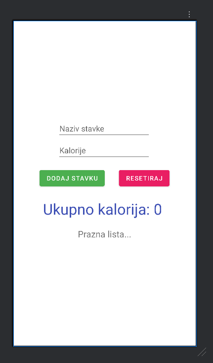

<div>

# Mobilne Aplikacije

**Nositelj**: doc. dr. sc. Nikola Tanković  
**Izvođač**: dr. sc. Robert Šajina  
**Asistent**: mag. inf. Alesandro Žužić  

**Ustanova**: Sveučilište Jurja Dobrile u Puli, Fakultet informatike u Puli

<p style="float: clear; display: flex; gap: 8px; align-items: center;" class="font-brioni text-sm whitespace-nowrap">
    </img>
    Fakultet informatike u Puli
</p>

# [3] - Interakcija s elementima (FoodTracker)

**Posljednje ažurirano:** 30. listopada 2025.

## Sadržaj
<!-- TOC -->
- [Sadržaj](#sadržaj)
- [Primjer FoodTracker](#primjer-foodtracker)
<!-- /TOC -->

---
Postavljanje Android studio projekta i Emulatora + vježbe slaganja UI elemenata, simple non interactive elementi

## Primjer FoodTracker

Napraviti ćemo aplikaciju za praćenje kalorija. Prvo ćemo kreirati novu klasu `FoodItem.java`:

<div style="width: fit-content; display: flex; flex-direction: column;">
    <div style="display: flex; justify-content: center;">
        
    </div>
    <br/>
    <p style="margin-top: -16px; width: 100%; text-align: center;"><i>Nova Java klasa</i></p>
</div>

<div style="width: fit-content; display: flex; flex-direction: column;">
    <div style="display: flex; justify-content: center;">
        
    </div>
    <br/>
    <p style="margin-top: -16px; width: 100%; text-align: center;"><i>Naziv nove klase</i></p>
</div>

Zatim ćemo dodati sljedeći kôd u klasu:

```java
public class FoodItem {

    private String FoodName;
    private int Kalorije;

    FoodItem(String foodName, int kalorije) {
        this.FoodName = foodName;
        this.Kalorije = kalorije;
    }

    public String getFoodName() {
        return this.FoodName;
    }

    public int getKalorije() {
        return this.Kalorije;
    }

}
```

Klasa `FoodItem` predstavlja model podataka za prehrambeni proizvod:
  - **Atributi:**
    - `name` - naziv prehrambenog proizvoda (tipa `String`)
    - `calories` - broj kalorija (tipa `int`)
  - **Konstruktor:**
    - Prima naziv i broj kalorija te inicijalizira oba atributa
    - Atributi su označeni kao `final`, što znači da se mogu postaviti samo jednom - prilikom stvaranja objekta
  - **Metode:**
    - `getName()` vraća naziv proizvoda
    - `getCalories()` vraća broj kalorija

> Ova klasa je **nepromjenjiva (*immutable*)** jer nakon stvaranja objekta njegovi podaci se više ne mogu mijenjati.

Zatim ćemo u `activity_main.xml` dodati dva polja za unos:
  - polje za textualni input - `Plain Text` `<EditText>` element
  - polje za brojčani input - `Number` `<EditText>` element

Dodat ćemo dva dugma `<Button>` elementa:
  - jedno s nazivom "Dodaj stavku"
  - drugo s nazivom "Resetiraj"

Dodati text `<TextView>` elemente "*Ukupno kalorija: 0*" i "*Prazna lista...*".

Tako da izgleda ovako:

<div style="width: fit-content; display: flex; flex-direction: column;">
    <div style="display: flex; justify-content: center;">
        
    </div>
    <br/>
    <p style="margin-top: -16px; width: 100%; text-align: center;"><i>Izgled</i></p>
</div>

Zatim ćemo napraviti novu klasu `FoodTracker.java` i dodati sljedeći kôd:

```java
import java.util.ArrayList;
import java.util.List;

public class FoodTracker {
    private List<FoodItem> foodItems = new ArrayList<>();

    public void addFoodItem(FoodItem foodItem, Context context) {
        foodItems.add(foodItem);
        Toast.makeText(context, "Food item added successfully", Toast.LENGTH_SHORT).show();
    }

    public int getTotalCalories() {
        int totalCalories = 0;

        for (FoodItem foodItem : foodItems) {
            totalCalories += foodItem.getKalorije();
        }
        return totalCalories;
    }

    public List<FoodItem> getFoodItems() {
        return foodItems;
    }

    public void clearAll() {
        foodItems.clear();
    }

}
```

Klasa `FoodTracker` služi za praćenje unosa hrane i zbrajanje ukupnog broja kalorija.
- **Atribut:**
  - `foodItems` - lista objekata tipa `FoodItem`, u kojoj se pohranjuju svi dodani prehrambeni proizvodi
- **Metode:**
  - `addFood(String name, int calories)` - dodaje novi prehrambeni proizvod u listu, stvarajući novi objekt klase `FoodItem`
  - `getTotalCalories()` - prolazi kroz cijelu listu i zbraja kalorije svih proizvoda; vraća ukupni broj kalorija
  - `getFoodItems()` - vraća cijelu listu prehrambenih proizvoda
  - `clearAll()` - briše sve proizvode iz liste (prazni praćenje hrane)

U `MainActivity.java` dodat ćemo objekt **FoodTracker**:

```java
public class MainActivity extends AppCompatActivity {
  private FoodTracker foodTracker;
  ...
}
```

Sada kada imamo klase trebamo dohvatiti *reference* na elemente kosriteći njihov **ID** atribut. Pa ćemo dodati sljedeće nakon `setContentView()` funkcije:
```java
import android.widget.Button;
import android.widget.EditText;
import android.widget.TextView;

...
setContentView(R.layout.activity_main);

foodTracker = new FoodTracker();

TextView test = findViewById(R.id.test);
TextView lista = findViewById(R.id.lista);
EditText inputNaziv = findViewById(R.id.inputNaziv);
EditText inputKalorije = findViewById(R.id.inputKalorije);
Button dodaj = findViewById(R.id.btnDodaj);
Button resetiraj = findViewById(R.id.btnResetiraj);
...
```

Nako čega možemo dodati interakciju s elementima:

```java
dodaj.setOnClickListener(view -> {
    String naziv = inputNaziv.getText().toString();
    int kalorije = Integer.parseInt(inputKalorije.getText().toString());
    FoodItem noviItem = new FoodItem(naziv, kalorije);
    foodTracker.addFoodItem(noviItem,this);

    int ukupnoKalorija = foodTracker.getTotalCalories();
    test.setText("Ukupno kalorija: " + ukupnoKalorija);

    String stavke = "";
    for (FoodItem item : foodTracker.getFoodItems()) {
        stavke += item.getFoodName() + " - " +
                  item.getKalorije() + " kalorija\n";
    }
    lista.setText(stavke);

});

resetiraj.setOnClickListener(view -> {
    foodTracker.clearAll();
    test.setText("Ukupno kalorija: 0");
    lista.setText("");
});
```

<div style="width: fit-content; display: flex; flex-direction: column;">
    <div style="display: flex; justify-content: center;">
        
    </div>
    <br/>
    <p style="margin-top: -16px; width: 100%; text-align: center;"><i>Primjer</i></p>
</div>

</div>