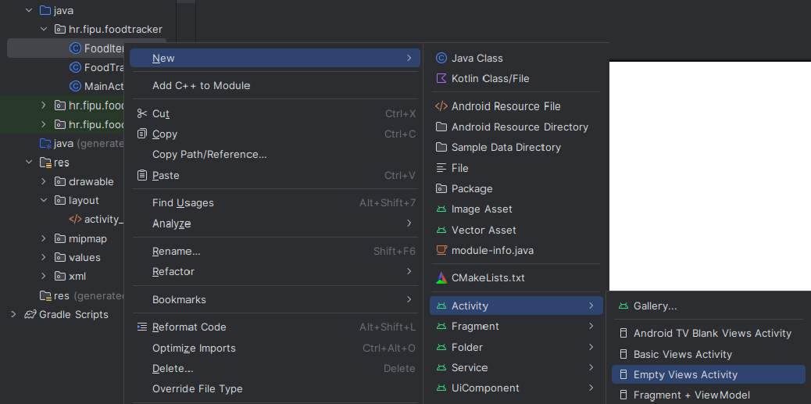
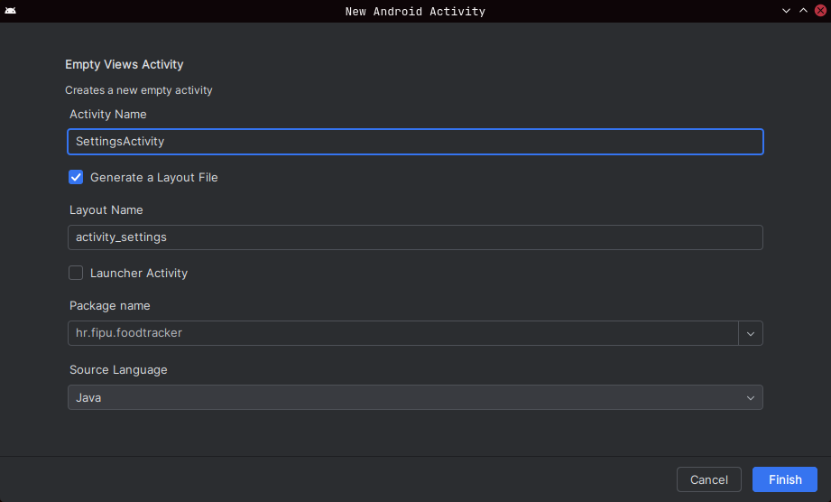
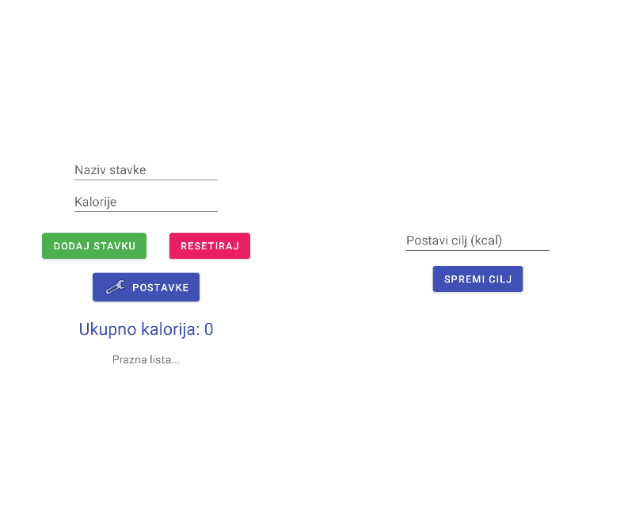
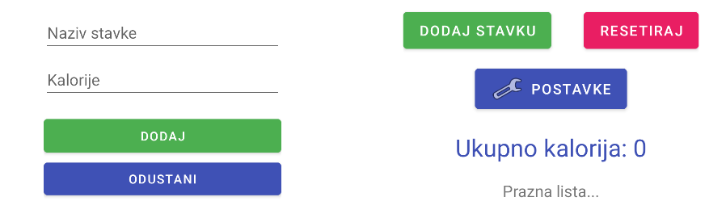
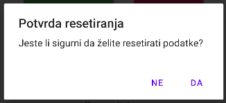

<div>

# Mobilne Aplikacije

**Nositelj**: doc. dr. sc. Nikola Tanković  
**Izvođač**: dr. sc. Robert Šajina  
**Asistent**: mag. inf. Alesandro Žužić  

**Ustanova**: Sveučilište Jurja Dobrile u Puli, Fakultet informatike u Puli

<p style="float: clear; display: flex; gap: 8px; align-items: center;" class="font-brioni text-sm whitespace-nowrap">
    </img>
    Fakultet informatike u Puli
</p>

# [4] - Aktivnosti i navigacija

**Posljednje ažurirano:** 21. studenog 2025.

## Sadržaj
<!-- TOC -->
- [Sadržaj](#sadržaj)
- [Dodavanje nove aktivnosti](#dodavanje-nove-aktivnosti)
- [Intent i navigacija između aktivnosti](#intent-i-navigacija-između-aktivnosti)
    - [Singleton - dijeljenje podataka između aktivnosti](#singleton---dijeljenje-podataka-između-aktivnosti)
    - [Vraćanje na prethodnu aktivnost - finish()](#vraćanje-na-prethodnu-aktivnost---finish)
- [Razmjena podataka između aktivnosti - *extra* & *launcher*](#razmjena-podataka-između-aktivnosti---extra--launcher)
    - [Extra podaci](#extra-podaci)
    - [Launcher za pokretanje aktivnosti za rezultat](#launcher-za-pokretanje-aktivnosti-za-rezultat)
- [Dijalog za potvrdu resetiranja liste](#dijalog-za-potvrdu-resetiranja-liste)
- [Snackbar za obavijest resetiranja i undo akciju](#snackbar-za-obavijest-resetiranja-i-undo-akciju)
<!-- /TOC -->

## Dodavanje nove aktivnosti

Proširit ćemo prethodni primjer aplikacije **FoodTracker** dodavanjem novih aktivnosti za postavljanje cilja unosa kalorija i dodavanje stavki. Naučit ćemo kako kreirati nove aktivnosti, kako navigirati između aktivnosti te kako prenositi podatke između njih.

<div class="page"></div>

Prvo, kreirajmo novu aktivnost za postavljanje cilja unosa kalorija.

<div style="width: fit-content; display: flex; flex-direction: column;">
    <div style="display: flex; justify-content: center;">
        
    </div>
    <br/>
    <p style="margin-top: -16px; width: 100%; text-align: center;"><i>Nova prazna aktivnost</i></p>
</div>

Namjestimo naziv nove aktivnosti na **SettingsActivity** i dodajmo polje za unos cilja kalorija u odgovarajući XML layout. Također ćemo dodati gumb za spremanje cilja kalorija.

<div style="width: fit-content; display: flex; flex-direction: column;">
    <div style="display: flex; justify-content: center;">
        
    </div>
    <br/>
    <p style="margin-top: -16px; width: 100%; text-align: center;"><i>SettingsActivity</i></p>
</div>

<div class="page"></div>

U MainActivity-ju dodajmo gumb za navigaciju do SettingsActivity-ja.

<div style="width: fit-content; display: flex; flex-direction: column;">
    <div style="display: flex; justify-content: center;">
        
    </div>
    <br/>
    <p style="margin-top: -16px; width: 100%; text-align: center;"><i>GUI</i></p>
</div>

<div class="page"></div>

S obzirom da smo dodali cilj kalorija, potrebno je ažurirati klasu FoodTracker kako bi uključivala i ovaj novi atribut. Tako da ćemo dodato novi atribut **CaloriesGoal** s defaultnom vrijednošću od 1000 kalorija i (*get/set*) metode za dohvat i postavljanje ovog atributa.

```java
public class FoodTracker {
    private float CaloriesGoal = 1000;

    public float getCaloriesGoal() {
        return CaloriesGoal;
    }

    public void setCaloriesGoal(float caloriesGoal) {
        if (caloriesGoal < 0){
            throw new IllegalArgumentException("Calories goal cannot be less than 0");
        }
        CaloriesGoal = caloriesGoal;
    }
}
```

> *IllegalArgumentException* je iznimka koja se baca kada metoda primi neispravan argument.

## Intent i navigacija između aktivnosti

Navigacija između aktivnosti u Androidu se obično vrši pomoću *Intent*-a. *Intent* je objekt koji omogućava komunikaciju između različitih komponenti aplikacije, uključujući aktivnosti.

Za navigaciju do **SettingsActivity** iz **MainActivity**, koristit ćemo *Intent* na sljedeći način, kada korisnik klikne na gumb za postavke u **MainActivity**:

```java
import android.content.Intent;
...
Button postavke = findViewById(R.id.btnPostavke);
postavke.setOnClickListener(v -> {
    Intent intent = new Intent(MainActivity.this, SettingsActivity.class);
    startActivity(intent);
});
...
```

Ovdje kreiramo novi *Intent* koji specificira trenutnu aktivnost (`MainActivity.this`) i ciljnu aktivnost (`SettingsActivity.class`). Zatim pozivamo `startActivity(intent)` kako bismo pokrenuli novu aktivnost. Postoje dvije vrste namjera:
- **Eksplicitne** namjere specificiraju točno koju komponentu trebaju pokrenuti, kada navigiramo između aktivnosti ili pokrećemo servise unutar vlastite aplikacije.
- **Implicitne** namjere ne specificiraju komponentu, već opisuju radnju koju trebaju izvršiti, dopuštajući sustavu da odabere odgovarajuću komponentu, kada želimo koristiti vanjske aplikacije za izvršavanje radnje, kao što su otvaranje web stranica, slanje e-maila ili obavljanje poziva.

Sada trebamo ažurirati **SettingsActivity** kako bismo dohvatili uneseni cilj kalorija i spremili ga u instancu **FoodTracker** kada korisnik klikne na gumb za spremanje.

```java
...
foodTracker = new FoodTracker();

EditText inputCilj = findViewById(R.id.inputCilj);
inputCilj.setText(String.valueOf(foodTracker.getCaloriesGoal()));

Button btnSpremi = findViewById(R.id.btnSpremi);
btnSpremi.setOnClickListener(v -> {
    String caloriesGoalText = inputCilj.getText().toString();
    try {
        float caloriesGoal = Float.parseFloat(caloriesGoalText);
        foodTracker.setCaloriesGoal(caloriesGoal);
    }
    catch (Exception e) {
        Toast.makeText(this, e.getMessage(), Toast.LENGTH_SHORT).show();
    }
});
...
```

> Koristimo **try-catch** blok kako bismo uhvatili potencijalne iznimke koje mogu nastati prilikom parsiranja unosa korisnika ili postavljanja cilja kalorija, u ovom slučaju prikazujemo poruku o pogrešci iznimke pomoću **Toast** poruke.

### Singleton - dijeljenje podataka između aktivnosti

Sada imamo problem što je instanca **FoodTracker** kreirana unutar **SettingsActivity**, pa promjene koje napravimo neće biti vidljive u **MainActivity**. Stoga ćemo pretvoriti **FoodTracker** u **singleton** klasu kako bismo osigurali da postoji samo jedna instanca ove klase koja je dostupna iz svih aktivnosti.

> **Singleton** je obrazac koji osigurava da klasa ima samo jednu instancu i pruža globalnu točku pristupa toj instanci.

To radimo na način da dodamo statičku varijablu unutar klase koja će držati jedinu instancu klase i javnu statičku metodu koja će vraćati tu instancu.

<div class="page"></div>

Tako da ćemo modificirati klasu **FoodTracker** na sljedeći način:
```java
...
private static FoodTracker instance; // Statička varijabla za jedinu instancu

private FoodTracker() {
    // Privatni konstruktor kako bi se spriječilo instanciranje izvana
}

public static synchronized FoodTracker getInstance() {
    if (instance == null) {
        instance = new FoodTracker();
    }
    return instance;
}
...
```

- **Serializable** se koristi kako bi se omogućilo serijaliziranje objekata, što je korisno ako želimo prenijeti objekte između aktivnosti putem *Intent*-a. 
- **Synchronized** služi za osiguranje da je metoda thread-safe, što znači da samo jedan thread može pristupiti metodi u isto vrijeme, čime se sprječavaju problemi u višedretvenim okruženjima.

Sada možemo dohvatiti instancu **FoodTracker** u obje aktivnosti koristeći `FoodTracker.getInstance()`, čime osiguravamo da obje aktivnosti rade s istom instancom.

```java
// U MainActivity & SettingsActivity
foodTracker = FoodTracker.getInstance();
```

### Vraćanje na prethodnu aktivnost - finish()

Sada se želimo vratiti na **MainActivity** nakon što korisnik spremi cilj kalorija u **SettingsActivity**. 

```java
...
btnSaveGoal.setOnClickListener(v -> {
    ...
    Intent intent = new Intent(SettingsActivity.this, MainActivity.class);
    startActivity(intent);
});
...
```

<div class="page"></div>

Međutim, bolje je koristiti `finish()` metodu kako bismo zatvorili trenutnu aktivnost i vratili se na prethodnu aktivnost u **stogu** aktivnosti, umjesto da pokrećemo novu instancu **MainActivity**.

```java 
...
btnSaveGoal.setOnClickListener(v -> {
    ...
    finish(); // Zatvara SettingsActivity i vraća se na MainActivity
});
...
``` 

Kada korisnik klikne na gumb za spremanje, trenutna aktivnost (**SettingsActivity**) će se zatvoriti, a korisnik će se vratiti na prethodnu aktivnost (**MainActivity**).

Potrebno je u MainActivity ažurirati prikaz nakon povratka iz SettingsActivity kako bi se prikazao novi cilj kalorija. To možemo učiniti u `onResume()` metodi.

```java
...
@Override
protected void onResume() {
    TextView textUkupno = findViewById(R.id.ukupno);
    int ukupnoKalorija = foodTracker.getTotalCalories();
    textUkupno.setText("Ukupno kalorija: " + ukupnoKalorija + "/" + foodTracker.getCaloriesGoal());
}
...
``` 

Kada se **MainActivity** ponovno prikaže nakon povratka iz **SettingsActivity**, `onResume()` metoda će se pozvati, ažurirajući prikaz s novim ciljem kalorija.

Međutim sada nam se duplicira kôd za postavljanje teksta u TextView. Bolje je izdvojiti taj kôd u zasebnu metodu kako bismo izbjegli dupliciranje.

```java
...
private TextView textUkupno;

private void updateUI() {
    int ukupnoKalorija = foodTracker.getTotalCalories();
    textUkupno.setText("Ukupno kalorija: " + ukupnoKalorija + "/" + foodTracker.getCaloriesGoal());
}
...
```

*textUkupno* sada postavljamo u `onCreate()` metodi, a zatim pozivamo `updateUI()` unutar `onResume()` metode i kada dodamo novu stavku.

<div style="width: fit-content; display: flex; flex-direction: column;">
    <div style="display: flex; justify-content: center;">
        
    </div>
    <br/>
    <p style="margin-top: -16px; width: 100%; text-align: center;"><i>Postavljen cilj</i></p>
</div>

## Razmjena podataka između aktivnosti - *extra* & *launcher*

Ponekad je potrebno prenijeti podatke između aktivnosti bez korištenja singletona. To možemo učiniti pomoću *extra* podataka unutar *Intent*-a. 

Napravit ćemo novu aktivnost **AddItemActivity** koja će omogućiti korisniku da unese naziv i kalorijsku vrijednost nove stavke hrane.

<div style="width: fit-content; display: flex; flex-direction: column;">
    <div style="display: flex; justify-content: center;">
        
    </div>
    <br/>
    <p style="margin-top: -16px; width: 100%; text-align: center;"><i>AddItemActivity & MainActivity GUI Updated</i></p>
</div>

<div class="page"></div>

### Extra podaci

U **AddItemActivity**, nakon što korisnik unese podatke i klikne na gumb za dodavanje, kreirat ćemo novi *Intent* za povratak u **MainActivity** i dodati unesene podatke kao *extra*.

```java
...
EditText inputNaziv = findViewById(R.id.inputNaziv);
EditText inputKalorije = findViewById(R.id.inputKalorije);

Button btnSave = findViewById(R.id.btnDodajStavku);
Button btnCancel = findViewById(R.id.btnOdustani);

btnSave.setOnClickListener(v -> {
    Intent resultIntent = new Intent(); // Kreiramo prazan Intent za povratak rezultata

    String naziv = inputNaziv.getText().toString();
    Float kalorije = Float.parseFloat(inputKalorije.getText().toString());

    resultIntent.putExtra("naziv", naziv); // key-value parovi
    resultIntent.putExtra("kalorije", kalorije); // key-value parovi

    setResult(RESULT_OK, resultIntent); // Postavljamo rezultat za povratak u MainActivity
    finish(); // Zatvaramo AddItemActivity
});
btnCancel.setOnClickListener(v -> finish());
...
```

> **RESULT_OK** je standardna konstanta koja označava da je operacija uspješno završena.

<div class="page"></div>

### Launcher za pokretanje aktivnosti za rezultat

U **MainActivity**, pokrenut ćemo **AddItemActivity** koristeći **Launcher** i obraditi rezultat u `ActivityResultLauncher`.

```java
...
private ActivityResultLauncher<Intent> addItemLauncher = registerForActivityResult(
    new ActivityResultContracts.StartActivityForResult(),
    result -> {
        if (result.getResultCode() == RESULT_OK) {
            Intent data = result.getData();

            String naziv = data.getStringExtra("naziv"); // Dohvaćamo podatke
            float kalorije = data.getFloatExtra("kalorije", 0);

            foodTracker.addFoodItem(new FoodItem(naziv, kalorije)); // Dodajemo novu stavku

            updateUI();

            String stavke = "";
            for (FoodItem item : foodTracker.getFoodItems()) {
                stavke += item.getFoodName() + " - " +
                        item.getKalorije() + " kalorija\n";
            }
            textLista.setText(stavke);
        }
    }
);

btnDodaj.setOnClickListener(v -> {
    Intent intent = new Intent(MainActivity.this, AddItemActivity.class);
    addItemLauncher.launch(intent); // Pokrećemo AddItemActivity za rezultat
});
...
```

> **ActivityResultLauncher** je novi način za pokretanje aktivnosti za rezultat, koji zamjenjuje stariji `startActivityForResult()` metodu.

<div class="page"></div>

## Dijalog za potvrdu resetiranja liste

Kada korisnik klikne na gumb za resetiranje liste, prikazat ćemo dijalog za potvrdu kako bismo spriječili slučajno brisanje podataka. 

> **AlertDialog** je klasa koja omogućava prikazivanje dijaloga s porukama i opcijama za korisnika: 
- Pozitivni gumb (npr. "Da") za potvrdu akcije.
- Negativni gumb (npr. "Ne") za otkazivanje akcije

```java
...
resetiraj.setOnClickListener(view -> {
    AlertDialog.Builder builder = new AlertDialog.Builder(MainActivity.this);
    builder.setTitle("Potvrda resetiranja")
            .setMessage("Jeste li sigurni da želite resetirati podatke?")
            .setPositiveButton("Da", (dialog, which) -> {
                foodTracker.clearAll();
                int ukupnoKalorija = foodTracker.getTotalCalories();
                textUkupno.setText("Ukupno kalorija: " + ukupnoKalorija + "/" + foodTracker.getCaloriesGoal());
                textLista.setText("Prazna lista...");
            })
            .setNegativeButton("Ne", (dialog, which) -> dialog.dismiss())
            .create()
            .show();
});
...
```

<div style="width: fit-content; display: flex; flex-direction: column;">
    <div style="display: flex; justify-content: center;">
        
    </div>
    <br/>
    <p style="margin-top: -16px; width: 100%; text-align: center;"><i>Dijalog</i></p>
</div>

<div class="page"></div>

## Snackbar za obavijest resetiranja i undo akciju

Kada korisnik resetira podatke, prikazat ćemo **Snackbar** obavijest koja potvrđuje da su podaci uspješno resetirani. Dodajmo i mogućnost vraćanja (undo) kako bismo omogućili korisniku da odustane od resetiranja.

```java
...
.setPositiveButton("Da", (dialog, which) -> {
    // Spremi stare podatke za undo
    List<FoodItem> oldItems = new ArrayList<>(foodTracker.getFoodItems());
    float oldGoal = foodTracker.getCaloriesGoal();
    
    foodTracker.clearAll();
    int ukupnoKalorija = foodTracker.getTotalCalories();
    textUkupno.setText("Ukupno kalorija: " + ukupnoKalorija + "/" + foodTracker.getCaloriesGoal());
    textLista.setText("Prazna lista...");
    
    Snackbar.make(findViewById(R.id.main), "Podaci su uspješno resetirani.", Snackbar.LENGTH_LONG)
            .setAction("Undo", v -> {
                foodTracker.setCaloriesGoal(oldGoal);
                for (FoodItem item : oldItems) {
                    foodTracker.addFoodItem(item, this);
                }
                updateUI();
            })
            .show();
})
...
```

> Akcija **Undo** omogućava korisniku da oporaviti izbrisane podatke u **LENGTH_LONG** vremenom trajanja (*3.5 sekunde*).

<div style="width: fit-content; display: flex; flex-direction: column;">
    <div style="display: flex; justify-content: center;">
        
    </div>
    <br/>
    <p style="margin-top: -16px; width: 100%; text-align: center;"><i>Snackbar</i></p>
</div>

</div>