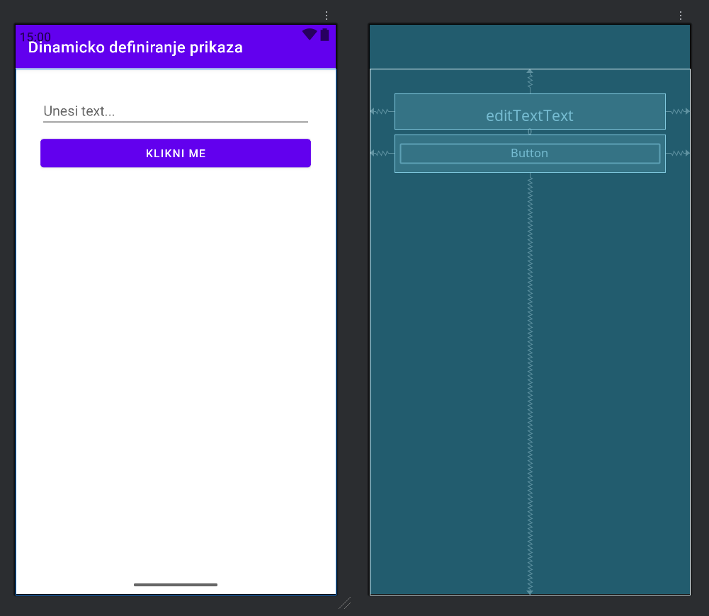
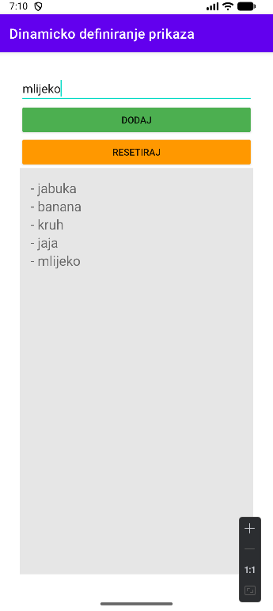

<div>

# Mobilne Aplikacije

**Nositelj**: doc. dr. sc. Nikola Tanković  
**Izvođač**: dr. sc. Robert Šajina  
**Asistent**: mag. inf. Alesandro Žužić  

**Ustanova**: Sveučilište Jurja Dobrile u Puli, Fakultet informatike u Puli

<p style="float: clear; display: flex; gap: 8px; align-items: center;" class="font-brioni text-sm whitespace-nowrap">
    </img>
    Fakultet informatike u Puli
</p>

# [5] - Dinamičko definiranje prikaza

**Posljednje ažurirano:** 21. studenog 2025.

## Sadržaj
<!-- TOC -->
- [Sadržaj](#sadržaj)
- [Programsko definiranje prikaza](#programsko-definiranje-prikaza)
- [Programska izmjena prikaza](#programska-izmjena-prikaza)
<!-- /TOC -->

<div class="page"></div>

## Programsko definiranje prikaza

U prethodnom poglavlju smo vidjeli kako definirati prikaz korištenjem XML datoteka. Međutim, moguće je definirati prikaz i programskim putem, tj. u samom kôdu aktivnosti ili fragmenta. Ovakav pristup može biti koristan kada želimo dinamički mijenjati izgled korisničkog sučelja na temelju određenih uvjeta ili podataka.

Primjerice, možemo stvoriti jednostavnu aktivnost koja programskim putem definira nekoliko elemenata i postavlja ih unutar `ConstraintLayout`. Izgledala bi kao na slici:

<div style="width: fit-content; display: flex; flex-direction: column;">
    <div style="display: flex; justify-content: center;">
        
    </div>
    <br/>
    <p style="margin-top: -16px; width: 100%; text-align: center;"><i>GUI za rekreirati</i></p>
</div>

Gdje mi želimo programskim putem definirati `EditText` i `Button` unutar `ConstraintLayout` da bude posloženo kao u xml datoteci.

<div class="page"></div>

```xml
<?xml version="1.0" encoding="utf-8"?>
<androidx.constraintlayout.widget.ConstraintLayout xmlns:android="http://schemas.android.com/apk/res/android"
    xmlns:app="http://schemas.android.com/apk/res-auto"
    xmlns:tools="http://schemas.android.com/tools"
    android:id="@+id/main"
    android:layout_width="match_parent"
    android:layout_height="match_parent"
    android:padding="32dp"
    tools:context=".MainActivity">

    <EditText
        android:id="@+id/editTextText"
        android:layout_width="0dp"
        android:layout_height="wrap_content"
        android:layout_marginBottom="8dp"
        android:ems="10"
        android:hint="Unesi text..."
        android:inputType="text"
        app:layout_constraintBottom_toTopOf="@+id/button"
        app:layout_constraintEnd_toEndOf="parent"
        app:layout_constraintHorizontal_bias="0.5"
        app:layout_constraintStart_toStartOf="parent"
        app:layout_constraintTop_toTopOf="parent"
        app:layout_constraintVertical_bias="0.0"
        app:layout_constraintVertical_chainStyle="packed" />

    <Button
        android:id="@+id/button"
        android:layout_width="0dp"
        android:layout_height="wrap_content"
        android:text="Klikni me"
        app:layout_constraintBottom_toBottomOf="parent"
        app:layout_constraintEnd_toEndOf="parent"
        app:layout_constraintHorizontal_bias="0.5"
        app:layout_constraintStart_toStartOf="parent"
        app:layout_constraintTop_toBottomOf="@+id/editTextText" />
</androidx.constraintlayout.widget.ConstraintLayout>
```

Prvo ćemo u `onCreate` metodi naše aktivnosti definirati `ConstraintLayout` i postaviti ga kao glavni prikaz aktivnosti. Zatim ćemo stvoriti `EditText` i `Button`, postaviti njihove atribute i dodati ih u `ConstraintLayout`. Na kraju, definirat ćemo ograničenja za pozicioniranje elemenata unutar `ConstraintLayout`.

1. Kreiramo `ConstraintLayout` i postavljamo ga kao glavni prikaz aktivnosti:

```java
...
ConstraintLayout mainLayout = new ConstraintLayout(this);
setContentView(mainLayout);
...
```

> `setConntentView()` uvijek mora biti pozvan nakon što smo definirali glavni layout.

2. Postavimo atribute za `ConstraintLayout` koristeći `setLayoutParams()` metodu:

```java
...
mainLayout.setLayoutParams(new ViewGroup.LayoutParams(
        ViewGroup.LayoutParams.MATCH_PARENT,
        ViewGroup.LayoutParams.MATCH_PARENT)
);
... 
```

Za postavljanje parametara izgleda koristimo `ViewGroup.LayoutParams` kako bismo definirali širinu i visinu `ConstraintLayout`-a. Da bismo dodali padding, koristimo `setPadding()` metodu:

```java
...
int mainPaddingDp = (int) TypedValue.applyDimension(TypedValue.COMPLEX_UNIT_DIP, 32, getResources().getDisplayMetrics());
mainLayout.setPadding(mainPaddingDp, mainPaddingDp, mainPaddingDp, mainPaddingDp);
...
```

Ovdje koristimo `TypedValue.applyDimension()` kako bismo pretvorili vrijednost paddinga iz dp u piksela, što je potrebno za pravilno postavljanje paddinga na različitim uređajima s različitim gustoćama ekrana.

3. Kreiramo `EditText` i postavljamo njegove atribute:

```java
...
EditText editText = new EditText(this);

editText.setHint("Unesi text...");
editText.setId(EditText.generateViewId());
editText.setInputType(InputType.TYPE_CLASS_TEXT);

editText.setLayoutParams(new ViewGroup.LayoutParams(
    0, ViewGroup.LayoutParams.WRAP_CONTENT)
);

mainLayout.addView(editText);
...
```

> Koristimo `EditText.generateViewId()` kako bismo generirali jedinstveni ID za `EditText`, što je važno za postavljanje ograničenja u `ConstraintLayout`.

<div class="page"></div>

4. Kreiramo `Button` i postavljamo njegove atribute:

```java
...
Button button = new Button(this);

button.setText("Klikni me");
button.setId(Button.generateViewId());

button.setLayoutParams(new ViewGroup.LayoutParams(
    0, ViewGroup.LayoutParams.WRAP_CONTENT)
);
mainLayout.addView(button);
...
```

5. Definiramo ograničenja za pozicioniranje elemenata unutar `ConstraintLayout`:

```java
...
ConstraintSet set = new ConstraintSet(); // Stvaramo constraint set
set.clone(mainLayout); // Kopiramo trenutne atribute iz constraint layout-a

// Constraint za EditText
set.connect(editText.getId(), ConstraintSet.START, ConstraintSet.PARENT_ID, ConstraintSet.START);
set.connect(editText.getId(), ConstraintSet.END, ConstraintSet.PARENT_ID, ConstraintSet.END);
set.setVerticalBias(editText.getId(), 0);

// Constraint za Button
set.connect(button.getId(), ConstraintSet.START, ConstraintSet.PARENT_ID, ConstraintSet.START);
set.connect(button.getId(), ConstraintSet.END, ConstraintSet.PARENT_ID, ConstraintSet.END);

```
Koristimo `ConstraintSet` kako bismo definirali veze između elemenata i roditeljskog `ConstraintLayout`.

<div class="page"></div>

6. Stvaramo vertikalni lanac kako bismo postigli željeni raspored elemenata:

```java
// Chain
set.createVerticalChain(
    ConstraintSet.PARENT_ID, ConstraintSet.TOP,
    ConstraintSet.PARENT_ID, ConstraintSet.BOTTOM,
    new int[]{editText.getId(), button.getId()}, //definira redoslijed elemenata u lancu
    null, 
    ConstraintSet.CHAIN_PACKED);

set.applyTo(mainLayout);
...
```

`createVerticalChain()` metoda omogućuje nam da definiramo lanac elemenata unutar `ConstraintLayout`, što nam pomaže u postizanju željenog rasporeda.

7. Na kraju, dodajemo kôd za pravilno rukovanje sistemskim prozorima:

```java
setContentView(mainLayout);
ViewCompat.setOnApplyWindowInsetsListener(mainLayout, (v, insets) -> {
    Insets systemBars = insets.getInsets(WindowInsetsCompat.Type.systemBars());
    v.setPadding(systemBars.left + mainPaddingDp,
                 systemBars.top + mainPaddingDp,
                 systemBars.right + mainPaddingDp,
                 systemBars.bottom + mainPaddingDp);
    return insets;
}); 
```

> Ovaj dio kôda osigurava da naš `ConstraintLayout` pravilno obrađuje sistemske prozore (*kao što su statusna traka i navigacijska traka*) dodavanjem odgovarajućeg paddinga.


Nakon što pokrenemo aplikaciju, vidjet ćemo da su `EditText` i `Button` pravilno postavljeni unutar `ConstraintLayout`, baš kao što je definirano u XML datoteci.

Sada ćemo dodati funkcionalnost gumbu tako da prikaže unos iz `EditText`-a u `Toast` poruci kada se klikne.

```java
button.setOnClickListener(v -> {
    String inputText = editText.getText().toString();
    Toast.makeText(this, inputText, Toast.LENGTH_SHORT).show();
});
``` 

> Moguće je dodati ovaj kôd odmah nakon što smo definirali `Button` i prije nego što primijenimo `ConstraintSet`, čak i ako nije dodan u mainLayout.

<div class="page"></div>

## Programska izmjena prikaza

Pored programskog definiranja prikaza, moguće je i dinamički mijenjati postojeći prikaz tijekom izvođenja aplikacije. Na primjer, proširit ćemo našu prethodnu aplikaciju tako da kada kliknemo na gumb, tekst unesen u `EditText` bude prikazan u `TextView` koji ćemo dodati dinamički u `LinearLayout`. Također ćemo dodati dugme za brisanje svih unosa.

```java
// Stvaramo reset button i postavljamo njegove atribute
Button buttonReset = new Button(this);

buttonReset.setText("Resetiraj");
buttonReset.getBackground().setTint(Color.parseColor("#FF9800"));
buttonReset.setId(Button.generateViewId());

buttonReset.setLayoutParams(new ViewGroup.LayoutParams(
    0, ViewGroup.LayoutParams.WRAP_CONTENT)
);
mainLayout.addView(buttonReset);

// Stvaramo linear layout i postavljamo njegove atribute
LinearLayout linearLayout = new LinearLayout(this);

linearLayout.setOrientation(LinearLayout.VERTICAL);
linearLayout.setPadding(mainPaddingDp/2, mainPaddingDp/2, mainPaddingDp/2, mainPaddingDp/2);
linearLayout.setBackgroundColor(Color.parseColor("#E6E6E6"));
linearLayout.setId(LinearLayout.generateViewId());

linearLayout.setLayoutParams( new LinearLayout.LayoutParams(
    0, 0)
);
mainLayout.addView(linearLayout);
...
// Constraint za Reset Button
set.connect(buttonReset.getId(), ConstraintSet.START, ConstraintSet.PARENT_ID, ConstraintSet.START);
set.connect(buttonReset.getId(), ConstraintSet.END, ConstraintSet.PARENT_ID, ConstraintSet.END);
// Constraint za Linear Layout
set.connect(linearLayout.getId(), ConstraintSet.START, ConstraintSet.PARENT_ID, ConstraintSet.START);
set.connect(linearLayout.getId(), ConstraintSet.END, ConstraintSet.PARENT_ID, ConstraintSet.END);

set.createVerticalChain(
        ConstraintSet.PARENT_ID, ConstraintSet.TOP,
        ConstraintSet.PARENT_ID, ConstraintSet.BOTTOM,
        new int[]{editText.getId(), buttonAdd.getId(), buttonReset.getId(), linearLayout.getId()},
        null,
        ConstraintSet.CHAIN_PACKED);
...
```
> Potrebno je prethodno ažurirati vertikalni lanac kako bi uključio nove elemente.

Sada ćemo ažurirati `OnClickListener` za glavni gumb kako bismo dodali novi `TextView` u `LinearLayout` svaki put kada se klikne. Također ćemo dodati `OnClickListener` za reset gumb koji će ukloniti sve `TextView` elemente iz `LinearLayout`.

```java
buttonAdd.setOnClickListener(v -> {
    String inputText = editText.getText().toString();
    TextView textView = new TextView(this);
    textView.setTextSize(20);
    textView.setText("- " + inputText);
    linearLayout.addView(textView);
});

buttonReset.setOnClickListener(v -> {
    linearLayout.removeAllViews();
});
```

Sada, svaki put kada korisnik unese tekst u `EditText` i klikne na gumb "Klikni me", novi `TextView` će biti dodan u `LinearLayout` s unesenim tekstom. Kada korisnik klikne na gumb "Resetiraj", svi unosi će biti uklonjeni iz `LinearLayout`.

<div style="width: fit-content; display: flex; flex-direction: column;">
    <div style="display: flex; justify-content: center;">
        
    </div>
    <br/>
    <p style="margin-top: -16px; width: 100%; text-align: center;"><i>Dinamičko dodavanje elemenata</i></p>
</div>

</div>