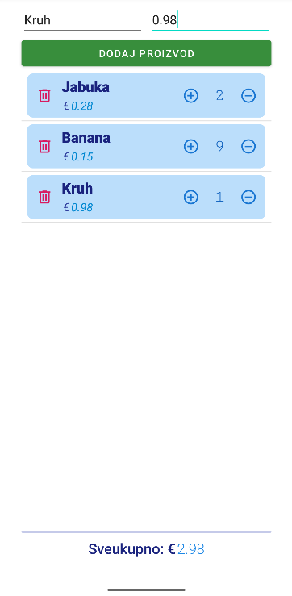

<div>

# Mobilne Aplikacije

**Nositelj**: doc. dr. sc. Nikola Tanković  
**Izvođač**: dr. sc. Robert Šajina  
**Asistent**: mag. inf. Alesandro Žužić  

**Ustanova**: Sveučilište Jurja Dobrile u Puli, Fakultet informatike u Puli

<p style="float: clear; display: flex; gap: 8px; align-items: center;" class="font-brioni text-sm whitespace-nowrap">
    </img>
    Fakultet informatike u Puli
</p>

# [6] - Adapters i ViewHolder pattern

**Posljednje ažurirano:** 11. prosinca 2025.

## Sadržaj
<!-- TOC -->
- [Sadržaj](#sadržaj)
- [Adapteri](#adapteri)
- [ViewHolder pattern](#viewholder-pattern)
- [RecyclerView](#recyclerview)
    - [Primjer korištenja RecyclerView](#primjer-korištenja-recyclerview)
    - [Primjer Košarica](#primjer-košarica)
    - [Ažuriranje RecyclerView](#ažuriranje-recyclerview)
<!-- /TOC -->

<div class="page"></div>

## Adapteri

Adapter u Androidu predstavlja ključnu komponentu koja povezuje izvor podataka i njihov vizualni prikaz u korisničkom sučelju. Koristi se svaki put kada trebamo prikazati kolekciju elemenata, poput lista, nizova ili objekata, u obliku koji se može skrolati ili dinamički ažurirati.

**Adapter** ima nekoliko osnovnih zadataka:
- obavještava **RecyclerView** koliko elemenata treba prikazati
- određuje izgled **pojedinog elementa** liste, napuhavanjem layouta (*inflating layout*)
- **puni** svaki element konkretnim podacima (*tekst, slika, ikona, ...*)

Drugim riječima, Android bez adaptera ne zna:
- koliko stavki lista sadrži
- kako izgleda pojedina stavka
- kako se svaki redak puni sadržajem

**Adapter** tako preuzima ulogu prevoditelja između "suhih" podataka i stvarnog prikaza na ekranu. Omogućuje odvajanje logike prikaza od logike podataka, što olakšava održavanje, proširivanje i ponovno korištenje koda.

**Glavne komponente**

- **RecyclerView** – prikazuje listu elemenata
- **LayoutManager** – definira raspored (*vertikalni, horizontalni, mrežni*)
- **Adapter** – povezuje podatke s prikazom, kreira **ViewHolder** i puni elemente
- **ViewHolder** – čuva reference na UI elemente unutar itema radi bržeg bindanja
- **ItemDecoration** – dodaje razmake, obrube ili linije između itema
- **ItemAnimator** – animira dodavanje, brisanje i promjene stavki

> Prije se koristio *ListView*, međutim moderni Android danas preferira *RecyclerView*, jer *ListView* ima ograničenja

## ViewHolder pattern

`ViewHolder` pattern koristi se kako bi *RecyclerView* radio učinkovitije, posebno kada lista sadrži veliki broj elemenata. Njegova glavna svrha je **izbjegavanje ponovljenih i skupih poziva `findViewById`**, koji bi inače usporavali listu prilikom pomicanja.

Kada se jedan prikaz reciklira, *RecyclerView* ponovno koristi već postojeći View umjesto da kreira novi. Bez *ViewHoldera*, svaki put bi se moralo ispočetka tražiti reference na UI elemente unutar itema (*npr. TextView, ImageView*), što je neefikasno.

*ViewHolder* rješava taj problem tako da **jednom pronađe sve potrebne view elemente i spremi ih u objekte**, pa adapter može direktno pristupiti tim referencama.

- U `onCreateViewHolder()` se napuhuje (*inflate*) layout za jedan item i inicijalno kreira *ViewHolder* koji čuva sve UI reference
- U `onBindViewHolder()` adapter samo postavlja podatke u te već spremljene view elemente bez dodatnog pretraživanja, što omogućuje brzo i glatko pomicanje

## RecyclerView

`RecyclerView` je napredna komponenta za prikaz lista i kolekcija podataka. Dizajniran je tako da radi brzo, učinkovito i fleksibilno, posebno kada radimo s velikim brojem elemenata. Ključni princip je **recikliranje prikaza** – umjesto da za svaki element stvara novi View, *RecyclerView* ponovno koristi već postojeće prikaze koji više nisu na ekranu.

> *RecyclerView* je dio AndroidX biblioteke, stoga ga je potrebno dodati u projekt putem `build.gradle` datoteke prije korištenja ili ga preuzeti unutar *Palette* GUI-a kod XML pregleda.

Za razliku od starijeg `ListView`, `RecyclerView` omogućuje:
- potpunu kontrolu nad rasporedom elemenata putem različitih `LayoutManagera`
- dodavanje ukrasnih elemenata i razmaka preko `ItemDecoration`
- animacije pri dodavanju, uklanjanju i promjenama elemenata
- lakše korištenje *ViewHolder* patterna koji je obvezan i poboljšava performanse

### Primjer korištenja RecyclerView

Dodat ćemo **RecyclerView** u `activity_main.xml` iz *Palette* GUI-a:

```xml
<androidx.constraintlayout.widget.ConstraintLayout xmlns:android="http://schemas.android.com/apk/res/android"
    xmlns:app="http://schemas.android.com/apk/res-auto"
    xmlns:tools="http://schemas.android.com/tools"
    android:id="@+id/main"
    android:layout_width="match_parent"
    android:layout_height="match_parent"
    tools:context=".MainActivity">

    <androidx.recyclerview.widget.RecyclerView
        android:id="@+id/myRecyclerView"
        android:layout_width="0dp"
        android:layout_height="0dp"
        app:layoutManager="androidx.recyclerview.widget.LinearLayoutManager"
        android:layout_marginStart="32dp"
        android:layout_marginTop="32dp"
        android:layout_marginEnd="32dp"
        android:layout_marginBottom="32dp"
        app:layout_constraintBottom_toBottomOf="parent"
        app:layout_constraintEnd_toEndOf="parent"
        app:layout_constraintStart_toStartOf="parent"
        app:layout_constraintTop_toTopOf="parent" />
</androidx.constraintlayout.widget.ConstraintLayout>
```

<div style="width: fit-content; display: flex; flex-direction: column;">
    <div style="display: flex; justify-content: center;">
        
    </div>
    <br/>
    <p style="margin-top: -16px; width: 100%; text-align: center;"><i>Dodavanje RecyclerView</i></p>
</div>

- Potrebno je postaviti `app:layoutManager`, inače stavke neće biti prikazani jer *RecyclerView* ne zna kako rasporediti elemente

```xml
<androidx.recyclerview.widget.RecyclerView
    app:layoutManager="androidx.recyclerview.widget.LinearLayoutManager"
    ...
/>
```

Zatim ćemo napraviti jedan item (`list_item.xml`) u *layout* direktoriju:

```xml
<LinearLayout xmlns:android="http://schemas.android.com/apk/res/android"
    android:layout_width="match_parent"
    android:layout_height="wrap_content">
    <TextView
        android:id="@+id/textView"
        android:layout_width="0dp"
        android:layout_height="wrap_content"
        android:layout_weight="1"/>
</LinearLayout>
```

<div style="width: fit-content; display: flex; flex-direction: column;">
    <div style="display: flex; justify-content: center;">
        
    </div>
    <br/>
    <p style="margin-top: -16px; width: 100%; text-align: center;"><i>list_item.xml</i></p>
</div>

- Potrebno je postaviti `android:layout_height` na `wrap_content`, inače će biti prikazan samo jedna stavka jer će svi itemi imati visinu jednaku visini roditeljskog RecyclerView-a

Sada možemo napraviti **Adapter** klasu `MyAdapter.java`:

```java
public class MyAdapter extends RecyclerView.Adapter<MyAdapter.MyViewHolder> {

    private final List<String> items;
    public MyAdapter(List<String> items) {
        this.items = items;
    }

    public static class MyViewHolder extends RecyclerView.ViewHolder {
        TextView text;

        public MyViewHolder(@NonNull View itemView) {
            super(itemView);
            text = itemView.findViewById(R.id.textView);
        }
        void bind(String item) {
            text.setText(item);
        }
    }

    @NonNull
    @Override
    public MyViewHolder onCreateViewHolder(@NonNull ViewGroup parent, int viewType) {
        View view = LayoutInflater.from(parent.getContext())
                .inflate(R.layout.list_item, parent, false);
        return new MyViewHolder(view);
    }

    @Override
    public void onBindViewHolder(@NonNull MyViewHolder holder, int position) {
        String item =items.get(position);
        holder.bind(item);
    }

    @Override
    public int getItemCount() {
        return items.size();
    }
}
```

Korištenje u aktivnosti `MainActivity.java`:

```java
RecyclerView recycler = findViewById(R.id.myRecyclerView);
MyAdapter adapter = new MyAdapter(
    Arrays.asList("Item 1", "Item 2", "Item 3", "Item 4")
);
recycler.setAdapter(adapter);
```

- Pronalazimo RecyclerView u layoutu
- Kreiramo instancu `MyAdapter` s listom stavki
- Postavljamo adapter na RecyclerView

<div style="width: fit-content; display: flex; flex-direction: column;">
    <div style="display: flex; justify-content: center;">
        
    </div>
    <br/>
    <p style="margin-top: -16px; width: 100%; text-align: center;"><i>RecyclerView primjer</i></p>
</div>

`MyAdapter` klasa je velika tako da ćemo je razdijeliti u sekcije i pobjasniti. Prvo kreiramo klasu adaptera koja nasljeđuje `RecyclerView.Adapter` i koristi vlastiti `ViewHolder`. U adapteru držimo listu podataka.

```java
public class MyAdapter extends RecyclerView.Adapter<MyAdapter.MyViewHolder> {

    private final List<String> items;

    public MyAdapter(List<String> items) {
        this.items = items;
    }
    ...
```

- `items` sadrži sve stavke koje želimo prikazati
- Konstruktor `MyAdapter` prima listu stavki koju sprema u polje

Nakon toga definiramo **ViewHolder** `MyViewHolder` koji drži reference na UI elemente i može ih popuniti podacima.

```java
    ...
    public static class MyViewHolder extends RecyclerView.ViewHolder {
        TextView text;

        public MyViewHolder(@NonNull View itemView) {
            super(itemView);
            text = itemView.findViewById(R.id.itemText);
        }

        void bind(String item) {
            text.setText(item);
        }
    }
    ...
```

- Konstruktor *ViewHoldera* pronalazi `TextView` u layoutu itema i sprema referencu u polje `text`
- Metoda `bind` postavlja tekst u `TextView` kada se pozove iz adaptera

Adapter **mora kreirati** *ViewHolder* kada *RecyclerView* zatraži novi element.

```java
    @NonNull
    @Override
    public MyViewHolder onCreateViewHolder(@NonNull ViewGroup parent, int viewType) {
        View view = LayoutInflater.from(parent.getContext())
                .inflate(R.layout.list_item, parent, false);
        return new MyViewHolder(view);
    }
```

1. `LayoutInflater.from(parent.getContext())` – dobiva inflater iz konteksta roditeljskog ViewGroup-a
    - `parent` je RecyclerView koji sadrži iteme
    - `getContext()` vraća kontekst aplikacije ili aktivnosti u kojoj se RecyclerView nalazi
    - Inflater se koristi za napuhivanje (*učitavanje*) XML layout datoteka u stvarne View objekte u memoriji
2. `.inflate(R.layout.list_item, parent, false)` – napuhuje (učitava) XML layout datoteku `list_item.xml` u View objekat
    - `R.layout.list_item` je referenca na XML datoteku koja definira izgled jednog itema u listi
    - `parent` je roditeljski ViewGroup (RecyclerView) koji će sadržavati ovaj item
    - `false` znači da se novi View neće odmah dodati u roditelja
3. `return new MyViewHolder(view)` – kreira i vraća novi ViewHolder s referencama na UI elemente iz napuhanog layout-a
    - `view` je root View napuhanog layouta koji se prosljeđuje konstruktoru ViewHolder-a

- Ova metoda se poziva samo kada je potreban novi ViewHolder (*npr. pri inicijalnom prikazu ili kada nema recikliranih ViewHolder-a dostupnih*)

Kada *RecyclerView* treba prikazati podatke u određenom položaju, poziva se `onBindViewHolder()`:

```java
    @Override
    public void onBindViewHolder(@NonNull MyViewHolder holder, int position) {
        String item = items.get(position);
        holder.bind(item);
    }
```

- Prima *ViewHolder* i poziciju stavke koja se treba prikazati
- Dohvaća podatke iz liste `items` na danoj poziciji
- Poziva `bind()` metodu *ViewHoldera* kako bi postavio podatke

Na kraju postavljamo `getItemCount()` metodu:

```java
    @Override
    public int getItemCount() {
        return items.size();
    }
}
```

- Vraća ukupan broj stavki u adapteru
- Bez ove metode *RecyclerView* ne zna koliko elemenata treba prikazati
- Služi za određivanje veličine liste koja će biti prikazana (*npr. paginacija*)

### Primjer Košarica

Kao primjer složenijeg adaptera, napravit ćemo aplikaciju za košaricu u trgovini. Košarica će sadržavati listu proizvoda s nazivom, cijenom i količinom. Također ćemo imati mogućnost povećanja i smanjenja količine proizvoda, dodavanje i uklanjanje proizvoda te izračun ukupne cijene svih proizvoda.

Napravit ćemo klasu `Proizvod`, koja predstavlja jedan proizvod u košarici. Ima sljedeća svojstva i metode:
- Naziv proizvoda (`naziv`)
- Cijena po jedinici (`cijena`)
- Količina proizvoda u košarici (`kolicina`)
- `povecajKolicinu(int kolicina)` 
    - Povećanje količine ne smije prijeći 100
- `smanjiKolicinu(int kolicina)`
    - Smanjenje količine ne smije ići ispod 0
- `izracunajUkupnuCijenu()`
    - Metoda vraća ukupnu cijenu kao `double`
    - Zaokružuje rezultat na dvije decimale

```java
public class Proizvod {
    private String naziv;
    private double cijena;
    private int kolicina;

    public Proizvod(String naziv, double cijena, int kolicina) {
        this.naziv = naziv;
        this.cijena = cijena;
        this.kolicina = kolicina;
    }

    public String getNaziv() { return naziv; }
    public double getCijena() { return cijena; }
    public int getKolicina() { return kolicina; }

    public void povecajKolicinu(int kolicina) {
        if (this.kolicina + kolicina < 100) this.kolicina += kolicina;
    }
    public void smanjiKolicinu(int kolicina) {
        if (this.kolicina - kolicina > 0) this.kolicina -= kolicina;
    }
    public double izracunajUkupnuCijenu() { return cijena * kolicina; }
}
```

Zatim ćemo napraviti klasu `Kosarica`, koja predstavlja košaricu s proizvodima. Ima sljedeća svojstva i metode:
- Lista proizvoda u košarici (`proizvodi`)
- `getProizvodi()`
    - Vraća listu proizvoda
- `dodajProizvod(Proizvod proizvod)`
    - Dodaje proizvod u košaricu
- `ukloniProizvod(Proizvod proizvod)`
    - Uklanja proizvod iz košarice
- `ukupanIznos()`
    - Vraća ukupan iznos svih proizvoda u košarici kao `double`
    - Zaokružuje rezultat na dvije decimale

```java
public class Kosarica {
    private List<Proizvod> proizvodi = new ArrayList<>();

    public List<Proizvod> getProizvodi() { return proizvodi; }

    public void dodajProizvod(Proizvod proizvod){ proizvodi.add(proizvod); }

    public void ukloniProizvod(Proizvod proizvod){ proizvodi.remove(proizvod); }

    public double ukupanIznos() {
        double ukupanIznos = 0;
        for (Proizvod proizvod : proizvodi) 
            ukupanIznos += proizvod.izracunajUkupnuCijenu();
        return Math.round(ukupanIznos * 100.0) / 100.0;
    }
}
```

Napravit ćemo `MainActivity.java` gdje ćemo koristiti `Kosarica` i dodati nekoliko proizvoda.
U `MainActivity.java` ćemo napraviti instancu `Kosarica` i dodati nekoliko proizvoda:

```java
private Kosarica kosarica;
...
@Override 
protected void onCreate(Bundle savedInstanceState) {
    ...
    kosarica = new Kosarica();

    Proizvod jabuka = new Proizvod("Jabuka", 0.28f, 2);
    Proizvod banana = new Proizvod("Banana", 0.16f, 5);
    Proizvod breskva = new Proizvod("Breskva", 0.42f, 1);

    kosarica.dodajProizvod(jabuka);
    kosarica.dodajProizvod(banana);
    kosarica.dodajProizvod(breskva);
    ...
}
```

``activity_main.xml`` će sadržavati `RecyclerView` za prikaz proizvoda, `TextView` za prikaz ukupnog iznosa. EditText i Button-e za dodavanje novih proizvoda.

<div style="width: fit-content; display: flex; flex-direction: column;">
    <div style="display: flex; justify-content: center;">
        
    </div>
    <br/>
    <p style="margin-top: -16px; width: 100%; text-align: center;"><i>Kosarica - activity_main.xml</i></p>
</div>

Napravit ćemo layout za jedan proizvod u košarici `proizvod_item.xml` koji će sadržavati naziv proizvoda, cijenu, količinu, gumbe za povećanje i smanjenje količine te gumb za uklanjanje proizvoda iz košarice.

<div style="width: fit-content; display: flex; flex-direction: column;">
    <div style="display: flex; justify-content: center;">
        
    </div>
    <br/>
    <p style="margin-top: -16px; width: 100%; text-align: center;"><i>Kosarica - proizvod_item.xml</i></p>
</div>

Sada možemo napraviti `KosaricaAdapter.java` koji će nasljeđivati `RecyclerView.Adapter` i koristiti `KosaricaViewHolder` za prikaz proizvoda u košarici. U adapteru ćemo implementirati logiku za povećanje, smanjenje količine i uklanjanje proizvoda iz košarice.

```java
public class KosaricaAdapter extends RecyclerView.Adapter<KosaricaAdapter.ProizvodViewHolder> {

    // Referenca na košaricu
    private static Kosarica kosarica;

    // Listener za obavještavanje promjena u košarici
    public interface OnItemsChangedListener {  
        void onItemChanged(); 
    }

    // Referenca na listener & metoda za postavljanje listenera
    private OnItemsChangedListener itemsChangedListener;
    public void setOnItemsChangedListener(OnItemsChangedListener listener) {
        this.itemsChangedListener = listener;
    }

    // Konstruktor adaptera prima instancu košarice
    public KosaricaAdapter(Kosarica kosarica) { 
        KosaricaAdapter.kosarica = kosarica; 
    }
    ...
```

Definicija `ProizvodViewHolder` klase unutar `KosaricaAdapter`:

```java
...
public class ProizvodViewHolder extends RecyclerView.ViewHolder {

    // UI elementi za prikaz proizvoda
    TextView textNaziv;
    TextView textCijena;
    TextView textKolicina;
    ImageButton buttonAdd;
    ImageButton buttonMinus;
    ImageButton buttonRemove;

    // Konstruktor ViewHolder-a
    public ProizvodViewHolder(@NonNull View itemView) {
        super(itemView);
        textNaziv = itemView.findViewById(R.id.textNaziv);
        textCijena = itemView.findViewById(R.id.textCijena);
        textKolicina = itemView.findViewById(R.id.textKolicina);
        buttonAdd = itemView.findViewById(R.id.btnAdd);
        buttonMinus = itemView.findViewById(R.id.btnMinus);
        buttonRemove = itemView.findViewById(R.id.btnRemove);
    }

    // Metoda za postavljanje podataka i ponašanja gumba UI elemenata
    void postaviProizvod(Proizvod proizvod) {
        // Postavljanje podataka u UI elemente
        textNaziv.setText(proizvod.getNaziv());
        textCijena.setText(String.valueOf(proizvod.getCijena()));
        textKolicina.setText(String.valueOf(proizvod.getKolicina()));

        // Definiranje ponašanja gumba
        buttonAdd.setOnClickListener(view -> {
            proizvod.povecajKolicinu(1);
            textKolicina.setText(String.valueOf(proizvod.getKolicina()));
            // Obavještavanje listenera o promjeni
            itemsChangedListener.onItemChanged();
        });

        buttonMinus.setOnClickListener(view -> {
            proizvod.smanjiKolicinu(1);
            textKolicina.setText(String.valueOf(proizvod.getKolicina()));
            // Obavještavanje listenera o promjeni
            itemsChangedListener.onItemChanged();
        });

        buttonRemove.setOnClickListener(view -> {
            kosarica.ukloniProizvod(proizvod);
            // Obavještavanje listenera o promjeni
            itemsChangedListener.onItemChanged();
            // Obavještavanje adaptera o promjeni podataka
            notifyDataSetChanged();
        });
    }
}
...
```

- **`notifyDataSetChanged()`** obavještava adapter da su se podaci promijenili i da treba osvježiti prikaz

Metode adaptera za kreiranje i bindanje ViewHolder-a te dobivanje broja stavki:

```java
...
// Kreiranje ViewHolder-a
// napuhavanje layouta, vraćanje ViewHolder-a
@NonNull @Override
public ProizvodViewHolder onCreateViewHolder(@NonNull ViewGroup kosarica_recycler, int viewType) {
    View proizvod_item_view = LayoutInflater.from(kosarica_recycler.getContext())
            .inflate(R.layout.proizvod_item, kosarica_recycler, false);
    return new ProizvodViewHolder(proizvod_item_view);
}

// Bindanje podataka u ViewHolder
// postavljanje podataka u UI elemente, definiranje ponašanja gumba
@Override
public void onBindViewHolder(@NonNull ProizvodViewHolder proizvodViewHolder, int position) {
    Proizvod proizvod = kosarica.getProizvodi().get(position);
    proizvodViewHolder.postaviProizvod(proizvod);
}

// Dobivanje broja stavki u košarici - vraćanje veličine liste proizvoda, 
// koristi se za određivanje broja elemenata u RecyclerView-u
@Override
public int getItemCount() {
    return kosarica.getProizvodi().size();
}
```

Sada možemo koristiti `KosaricaAdapter` u `MainActivity.java`:
- Inicijaliziramo UI elemente i postavljamo početni ukupni iznos
- Postavljamo `OnClickListener` za gumb dodavanja proizvoda
- Inicijaliziramo `RecyclerView` i `KosaricaAdapter`, te postavljamo listener za ažuriranje ukupnog iznosa
- Dodajemo razdjelnike između stavki i postavljamo adapter na RecyclerView
- Metoda `updateTotalAmount()` ažurira prikaz ukupnog iznosa u TextView-u
- Metoda `dodajProizvod()` dodaje novi proizvod u košaricu i obavještava adapter o promjeni podataka

```java
    ...
    TextView textSveukupno;
    Button dugmeDodaj;
    EditText textProizvod;
    EditText textCijena;

    RecyclerView recycler;
    KosaricaAdapter adapter;

    @Override
    protected void onCreate(Bundle savedInstanceState) {
        ...
        // Inicijalizacija UI elemenata
        textSveukupno = findViewById(R.id.textSveukupno);
        dugmeDodaj = findViewById(R.id.btnDodaj);
        textProizvod = findViewById(R.id.inputNaziv);
        textCijena = findViewById(R.id.inputCijena);

        updateTotalAmount(); // Postavljanje početnog ukupnog iznosa
        dugmeDodaj.setOnClickListener(v -> dodajProizvod());

        // Postavljanje RecyclerView i adaptera
        recycler = findViewById(R.id.myRecyclerView);
        adapter = new KosaricaAdapter(kosarica);

        // Postavljanje listenera za ažuriranje ukupnog iznosa
        adapter.setOnItemsChangedListener(this::updateTotalAmount);

        // Dodavanje razdjelnika između stavki i postavljanje adaptera
        recycler.addItemDecoration(new DividerItemDecoration(this, DividerItemDecoration.VERTICAL));
        recycler.setAdapter(adapter);
    }

    // Metoda za ažuriranje ukupnog iznosa u TextView-u
    private void updateTotalAmount() {
        String totalText = String.valueOf(kosarica.ukupanIznos());
        textSveukupno.setText(totalText);
    }

    // Metoda za dodavanje novog proizvoda u košaricu
    private void dodajProizvod() {

        String nazivProizvoda = textProizvod.getText().toString();
        double cijenaProizvoda = Double.parseDouble(textCijena.getText().toString());
        Proizvod noviProizvod = new Proizvod(nazivProizvoda, cijenaProizvoda, 1);

        kosarica.dodajProizvod(noviProizvod);
        updateTotalAmount(); // Postavljanje početnog ukupnog iznosa

        // Obavještavanje adaptera o promjeni podataka
        adapter.notifyDataSetChanged();
    }
}
```

<div style="width: fit-content; display: flex; flex-direction: column;">
    <div style="display: flex; justify-content: center;">
        
    </div>
    <br/>
    <p style="margin-top: -16px; width: 100%; text-align: center;"><i>Kosarica recycler view</i></p>
</div>

### Ažuriranje RecyclerView

Kada se podaci u adapteru promijene, potrebno je obavijestiti *RecyclerView* da treba osvježiti prikaz. To se radi pozivom metode **`notifyDataSetChanged()`** unutar adaptera.

```java
    ...
    public void setItems(List<String> newItems) {
        this.items = newItems;
        notifyDataSetChanged();
    }
    ...
```

**`notifyDataSetChanged()`** koristimo kada se podaci u adapteru promijene i želimo da RecyclerView ponovno nacrta sve elemente.
- Bez ovog poziva RecyclerView neće automatski osvježiti prikaz, pa će stari podaci ostati prikazani
- Ova metoda obavještava adapter da su svi itemi potencijalno promijenjeni i da je potrebno ponovno izračunavanje svih ViewHolder-a
- Koristi se npr. nakon dodavanja, brisanja ili izmjene elemenata u listi podataka

> U praksi se **`notifyDataSetChanged()`** rijetko koristi jer ponovno bindanje svih itema nije učinkovito. Bolje je koristiti **`DiffUtil`** ili specifične metode poput `notifyItemInserted()`, `notifyItemRemoved()` ili `notifyItemChanged()` koje osvježavaju samo promijenjene elemente, što poboljšava performanse RecyclerView-a.

Možemo implementirati notifyItemRemoved() u `KosaricaAdapter` unutar `buttonRemove` OnClickListener-a:

```java
buttonRemove.setOnClickListener(view -> {
    kosarica.ukloniProizvod(proizvod);
    notifyItemRemoved(position);
    itemsChangedListener.onItemChanged();
});
```
> Potrebno je proslijediti `position` u `postaviProizvod()` metodu kako bi se znao točan položaj proizvoda koji se uklanja.

Možemo implementirati dodajProizvod() u `MainActivity` bez korištenja `notifyDataSetChanged()`:
```java
private void dodajProizvod() {
    String nazivProizvoda = textProizvod.getText().toString();
    double cijenaProizvoda = Double.parseDouble(textCijena.getText().toString());
    Proizvod noviProizvod = new Proizvod(nazivProizvoda, cijenaProizvoda, 1);

    kosarica.dodajProizvod(noviProizvod);
    // Obavještavanje adaptera o dodavanju novog proizvoda
    // size() - 1 jer je novi proizvod dodan na kraj liste
    adapter.notifyItemInserted(kosarica.getProizvodi().size() - 1);
    updateTotalAmount();
}
```

Drugi način je korištenje **DiffUtil** klase koja omogućuje efikasno izračunavanje razlika između starih i novih podataka te ažuriranje samo onih elemenata koji su se promijenili.
Napravit ćemo klasu `KosaricaDiffCallback` koja nasljeđuje `DiffUtil.Callback` i implementira potrebne metode za usporedbu starih i novih podataka.
- KosaricaDiffCallback prima dvije liste proizvoda: staru i novu
- Implementira metode za dobivanje veličine starih i novih lista, te za usporedbu stavki i njihovog sadržaja.
- `areItemsTheSame()` provjerava jesu li stavke iste
- `areContentsTheSame()` provjerava jesu li svojstva stavki ista (*npr. naziv, cijena, količina*)

```java
public class KosaricaDiffCallback extends DiffUtil.Callback {
    private final List<Proizvod> oldProizvodi;
    private final List<Proizvod> newProizvodi;

    public KosaricaDiffCallback(List<Proizvod> oldProizvodi, List<Proizvod> newProizvodi) {
        this.oldProizvodi = oldProizvodi;
        this.newProizvodi = newProizvodi;
    }

    @Override
    public int getOldListSize() { return oldProizvodi.size(); }

    @Override
    public int getNewListSize() { return newProizvodi.size(); }

    @Override
    public boolean areItemsTheSame(int oldItemPosition, int newItemPosition) {
        return oldProizvodi.get(oldItemPosition).equals(newProizvodi.get(newItemPosition));
    }

    @Override
    public boolean areContentsTheSame(int oldItemPosition, int newItemPosition) {
        return (oldProizvodi.get(oldItemPosition).getNaziv().equals(newProizvodi.get(newItemPosition).getNaziv()) &&
                oldProizvodi.get(oldItemPosition).getCijena()==newProizvodi.get(newItemPosition).getCijena() &&
                oldProizvodi.get(oldItemPosition).getKolicina()==newProizvodi.get(newItemPosition).getKolicina());
    }
}
```

Zatim ćemo u `KosaricaAdapter` implementirati metodu `setProizvodi()` koja koristi `DiffUtil` za izračunavanje razlika između starih i novih podataka te ažuriranje RecyclerView-a, te dodati `setProizvodi()` metodu u `Kosarica`:

```java
    // Metoda za postavljanje novih proizvoda u adapter koristeći DiffUtil
    ...
    public void setProizvodi(List<Proizvod> newProizvodi) {
        DiffUtil.DiffResult diffResult = DiffUtil.calculateDiff(
            new KosaricaDiffCallback(kosarica.getProizvodi(), newProizvodi)
        );
        // Ažuriranje liste proizvoda u kosarici
        kosarica.setProizvodi(new ArrayList<>(newProizvodi));
        // Obavještavanje adaptera o promjenama koristeći DiffUtil rezultat
        diffResult.dispatchUpdatesTo(this);
    }
    ...
    // U Kosarica klasi dodajemo setProizvodi metodu
    ...
    public void setProizvodi(List<Proizvod> proizvodi) { this.proizvodi = proizvodi; }
    ...
```

Sada možemo koristiti `setProizvodi()` metodu u `MainActivity` umjesto `notifyDataSetChanged()`:

```java
private void dodajProizvod() {
    String nazivProizvoda = textProizvod.getText().toString();
    double cijenaProizvoda = Double.parseDouble(textCijena.getText().toString());
    Proizvod noviProizvod = new Proizvod(nazivProizvoda, cijenaProizvoda, 1);

    // Kreiranje nove instance Kosarica s ažuriranim proizvodima
    Kosarica newKosarica = new Kosarica();
    newKosarica.setProizvodi(new ArrayList<>(kosarica.getProizvodi()));
    newKosarica.dodajProizvod(noviProizvod);
    // Ažuriranje adaptera s novom listom proizvoda koristeći DiffUtil
    adapter.setProizvodi(newKosarica.getProizvodi());
    // Ažuriranje ukupnog iznosa
    updateTotalAmount();
}
```

Isto tako možemo koristiti `setProizvodi()` metodu unutar `buttonRemove` OnClickListener-a u `KosaricaAdapter`:

```java
buttonRemove.setOnClickListener(view -> {
    // Kreiranje nove instance Kosarica s ažuriranim proizvodima
    Kosarica newKosarica = new Kosarica();
    newKosarica.setProizvodi(new ArrayList<>(kosarica.getProizvodi()));
    newKosarica.ukloniProizvod(proizvod);
    // Ažuriranje adaptera s novom listom proizvoda koristeći DiffUtil
    setProizvodi(newKosarica.getProizvodi());
    // Ažuriranje ukupnog iznosa
    itemsChangedListener.onItemChanged();
});
```

</div>