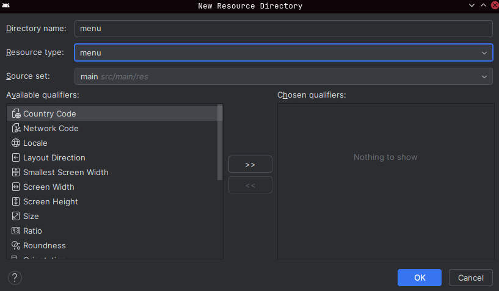
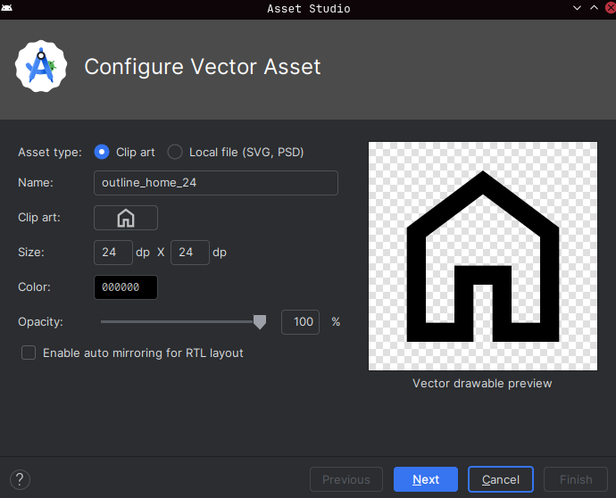
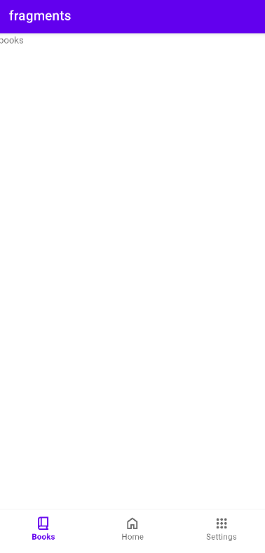
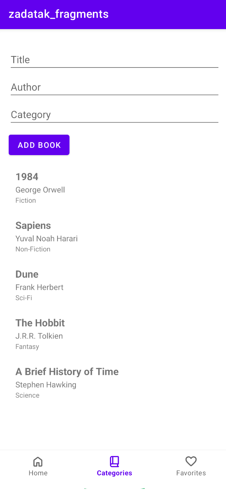
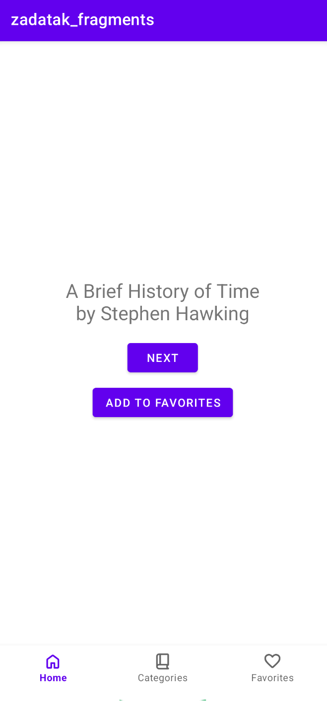
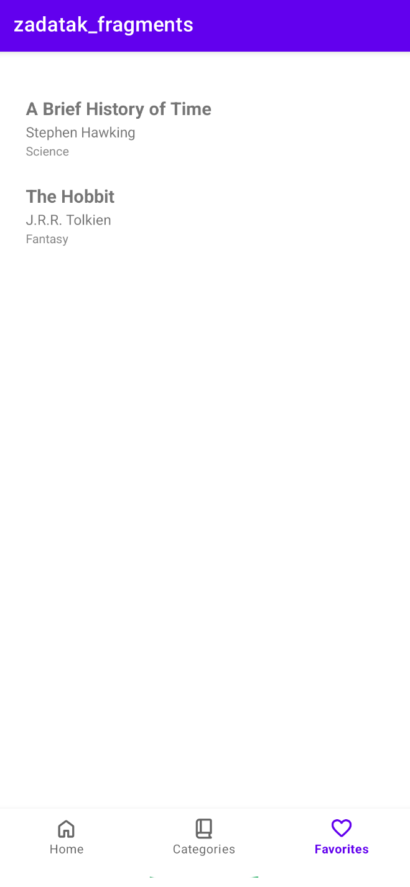

<div>

# Mobilne Aplikacije

**Nositelj**: doc. dr. sc. Nikola Tanković  
**Izvođač**: dr. sc. Robert Šajina  
**Asistent**: mag. inf. Alesandro Žužić  

**Ustanova**: Sveučilište Jurja Dobrile u Puli, Fakultet informatike u Puli

<p style="float: clear; display: flex; gap: 8px; align-items: center;" class="font-brioni text-sm whitespace-nowrap">
    </img>
    Fakultet informatike u Puli
</p>

# [6] - Fragments, Navigation & ViewModel

**Posljednje ažurirano:** 11. prosinca 2025.

## Sadržaj
<!-- TOC -->
- [Sadržaj](#sadržaj)
<!-- /TOC -->

<div class="page"></div>

## Fragmenti

Fragmenti su modularni dijelovi korisničkog sučelja koji omogućuju dinamičko upravljanje i prilagodbu izgleda aplikacije. Oni se koriste unutar aktivnosti i mogu se dodavati, uklanjati ili zamjenjivati tijekom izvođenja aplikacije.

Da bi se koristili fragmenti, potrebno je definirati njihov izgled u XML datoteci i implementirati njihovu logiku u odgovarajućoj klasi. Fragmenti se obično koriste za prikaz različitih dijelova korisničkog sučelja unutar jedne aktivnosti, što omogućuje bolju organizaciju koda i ponovnu upotrebu komponenti.

U MainActivity.xml datoteci definiramo layout `FrameLayout` za fragmente:

```xml
<androidx.constraintlayout.widget.ConstraintLayout xmlns:android="http://schemas.android.com/apk/res/android"
    xmlns:app="http://schemas.android.com/apk/res-auto"
    xmlns:tools="http://schemas.android.com/tools"
    android:id="@+id/main"
    android:layout_width="match_parent"
    android:layout_height="match_parent"
    tools:context=".MainActivity">

    <FrameLayout
        android:id="@+id/fragment_container"
        android:layout_width="0dp"
        android:layout_height="0dp"
        app:layout_constraintBottom_toTopOf="@+id/bottom_nav"
        app:layout_constraintEnd_toEndOf="parent"
        app:layout_constraintStart_toStartOf="parent"
        app:layout_constraintTop_toTopOf="parent"/>

</androidx.constraintlayout.widget.ConstraintLayout>

```

Zatim kreiramo prvi fragment `HomeFragment` s pripadajućim layoutom `fragment_home.xml`:

```xml
<?xml version="1.0" encoding="utf-8"?>
<FrameLayout xmlns:android="http://schemas.android.com/apk/res/android"
    xmlns:tools="http://schemas.android.com/tools"
    android:layout_width="match_parent"
    android:layout_height="match_parent"
    tools:context=".HomeFragment">

    <!-- TODO: Update blank fragment layout -->
    <TextView
        android:layout_width="match_parent"
        android:layout_height="match_parent"
        android:text="home" />

</FrameLayout>
```

```java
    package hr.fipu.fragments;

    import android.os.Bundle;
    import androidx.fragment.app.Fragment;
    import android.view.LayoutInflater;
    import android.view.View;
    import android.view.ViewGroup;

    public class HomeFragment extends Fragment {

        public HomeFragment() {
            // Required empty public constructor
        }

        @Override
        public View onCreateView(LayoutInflater inflater, ViewGroup container,
                                Bundle savedInstanceState) {
            // Inflate the layout for this fragment
            return inflater.inflate(R.layout.fragment_home, container, false);
        }
    }
```

Da bi u MainActivity prikazali fragment, koristimo `FragmentManager`:

```java
    getSupportFragmentManager().beginTransaction()
        .replace(R.id.fragment_container, new HomeFragment())
        .commit();
```

## Navigacija između fragmenata

Za upravljanje navigacijom između fragmenata, koristit ćemo Android Navigation Component biblioteku. Ova biblioteka pojednostavljuje implementaciju navigacije i omogućuje definiranje navigacijskog toka putem XML datoteke.

Stvorit ćemo još dva fragmenta: `BooksFragment` i `SettingsFragment`, s pripadajućim layoutima `fragment_books.xml` i `fragment_settings.xml`.

U activity_main.xml dodajemo `BottomNavigationView` za navigaciju između fragmenata:

```xml
<com.google.android.material.bottomnavigation.BottomNavigationView
    android:id="@+id/bottom_nav"
    android:layout_width="0dp"
    android:layout_height="wrap_content"
    app:layout_constraintBottom_toBottomOf="parent"
    app:layout_constraintEnd_toEndOf="parent"
    app:layout_constraintStart_toStartOf="parent"
    app:menu="@menu/bottom_menu"/>
```

Stvorit ćemo direktorij `menu` unutar `res` direktorija ako već ne postoji.



U resursima definiramo izbornik `bottom_menu.xml`:

```xml
<?xml version="1.0" encoding="utf-8"?>
<menu xmlns:android="http://schemas.android.com/apk/res/android">
    <item
        android:id="@+id/nav_books"
        android:icon="@drawable/outline_book_2_24"
        android:title="Books" />
    <item
        android:id="@+id/nav_home"
        android:icon="@drawable/outline_home_24"
        android:title="Home" />
    <item
        android:id="@+id/nav_settings"
        android:icon="@drawable/outline_apps_24"
        android:title="Settings" />
</menu>
```

Ikone za stavke izbornika mogu se dodati putem Android Studio Image Asset alata.



Sada ćemo u MainActivity postaviti slušatelj za odabir stavki izbornika:

```java
BottomNavigationView bottomNav = findViewById(R.id.bottom_nav);

bottomNav.setOnItemSelectedListener(item -> {
    Fragment fragment = null;

    if (item.getItemId() == R.id.nav_books)
        fragment = new BooksFragment();
    else if (item.getItemId() == R.id.nav_home)
        fragment = new HomeFragment();
    else if (item.getItemId() == R.id.nav_settings)
        fragment = new SettingsFragment();

    getSupportFragmentManager()
            .beginTransaction()
            .replace(R.id.fragment_container, fragment)
            .addToBackStack(null)
            .commit();

    return true;
});
```



Za dodavanje animacija prilikom navigacije između fragmenata, možemo koristiti `setCustomAnimations` metodu:

```java
.setCustomAnimations(
        R.anim.fade_in,  // enter
        R.anim.fade_out, // exit
        R.anim.fade_in,  // popEnter
        R.anim.fade_out  // popExit
)
```

Potrebno je definirati animacije u `res/anim` direktoriju.

Fade In:
```xml
<alpha xmlns:android="http://schemas.android.com/apk/res/android"
    android:fromAlpha="0.0"
    android:toAlpha="1.0"
    android:duration="300"/>
```
Fade Out:
```xml
<alpha xmlns:android="http://schemas.android.com/apk/res/android"
    android:fromAlpha="1.0"
    android:toAlpha="0.0"
    android:duration="300"/>
```

## ViewModel
ViewModel je komponenta arhitekture Android aplikacija koja omogućuje upravljanje podacima vezanim uz korisničko sučelje na način koji je otporan na promjene konfiguracije, poput rotacije zaslona. ViewModel pohranjuje i upravlja podacima te ih čini dostupnima za aktivnosti i fragmente.

```java
public class SharedViewModel extends ViewModel {
    
    private final MutableLiveData<String> selectedItem = new MutableLiveData<>();
    
    public void selectItem(String item) {
        selectedItem.setValue(item);
    }

    public LiveData<String> getSelectedItem() {
        return selectedItem;
    }
}
```

Sada možemo koristiti SharedViewModel u fragmentima za dijeljenje podataka:


BoooksFragment.java
```java
@Override
public View onCreateView(LayoutInflater inflater, ViewGroup container,
                            Bundle savedInstanceState) {
    View view = inflater.inflate(R.layout.fragment_books, container, false);

    SharedViewModel viewModel = new ViewModelProvider(requireActivity()).get(SharedViewModel.class);

    Button button = view.findViewById(R.id.button2);
    button.setOnClickListener(v -> {
        EditText editText = view.findViewById(R.id.inputKnjiga);
        String input = editText.getText().toString();
        viewModel.selectItem(input);
    });

    return view;
}
```

HomeFragment.java
```java
@Override
public View onCreateView(LayoutInflater inflater, ViewGroup container,
                            Bundle savedInstanceState) {

    View view = inflater.inflate(R.layout.fragment_home, container, false);

    SharedViewModel viewModel = new ViewModelProvider(requireActivity()).get(SharedViewModel.class);
    viewModel.getSelectedItem().observe(getViewLifecycleOwner(), item -> {
        TextView textView = view.findViewById(R.id.textView);
        textView.setText(item);

    });
    
    return view;
}
```

## Samostalni zadatak za vježbu

Napraviti aplikaciju koja omogućuje pregled/dodavanje knjiga i označavanje kao omiljena.

**Klasa knjige:**
- Naslov
- Autor
- Getter/Setter metode

**Adapter za RecyclerView**
- Sadrži listu knjiga
- Napraviti KnjigaItem layout za prikaz naslova i autora

**ViewModel**
- Sadrži listu svih knjiga
- Sadrži listu omiljenih knjiga
- Getteri
- metode `addBook` i `addFavorite`

**Fragmenti:**

1. **HomeFragment**
   - Prikazuje **nasumičnu knjigu dana** (naslov + autor)
   - Dugme "Sljedeća" prikazuje novu nasumičnu knjigu
   - Dugme "Dodaj u omiljene" dodaje knjigu u omiljene

2. **CategoriesFragment**
   - Prikazuje **liste knjiga**
   - Mogućnost dodavanja novih knjiga (naslov, autor).

3. **FavoritesFragment**
   - Prikazuje sve knjige koje je korisnik označio kao **omiljene**.
   - Dugme “Dodaj u omiljene” dostupno je u HomeFragment.

**BottomNavigationView:**
- Home / Categories / Favorites
- Home je default fragment

**Dodatno:**

- Svi fragmenti trebaju **koristiti ViewModel** za dijeljenje podataka između njih.
- Knjige se mogu spremati u **lokalni popis u ViewModel-u**, nije potreban database.
- Omogućiti filtriranje i sortiranje u CategoriesFragment (npr. po autoru ili abecedi).

**Inicijalni podaci:**
```java
new Book("1984", "George Orwell");
new Book("Sapiens", "Yuval Noah Harari");
new Book("Dune", "Frank Herbert");
new Book("The Hobbit", "J.R.R. Tolkien");
new Book("A Brief History of Time", "Stephen Hawking");
```





</div>