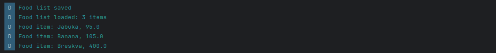
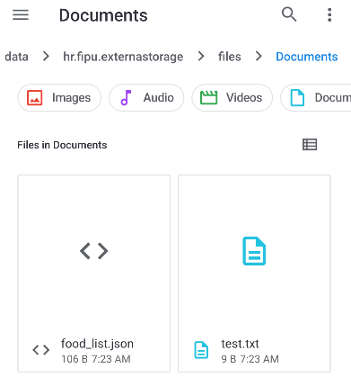
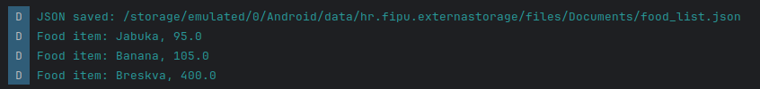
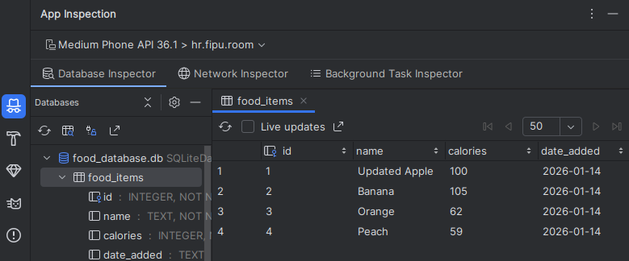
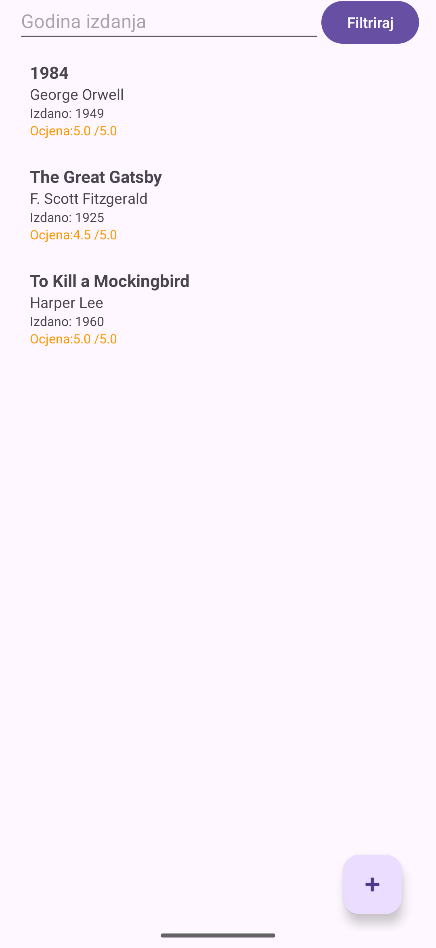
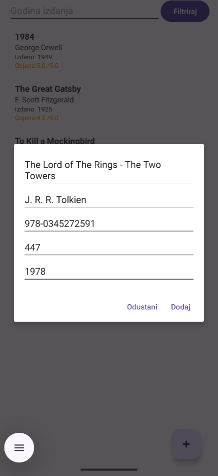
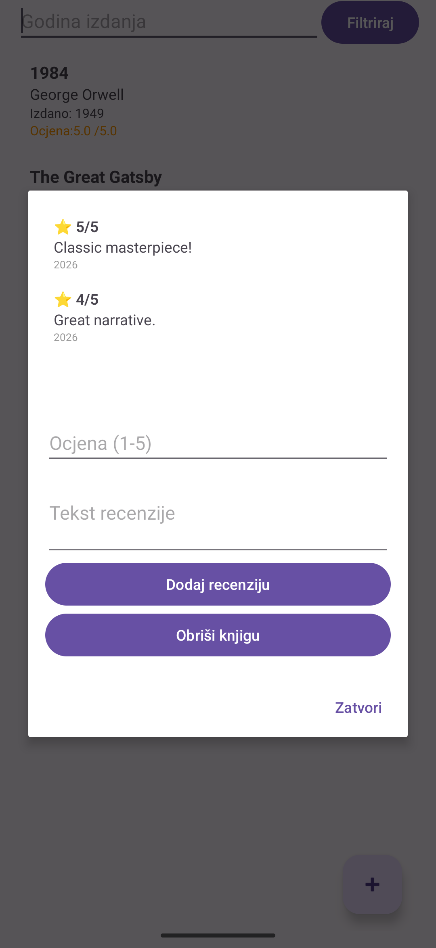
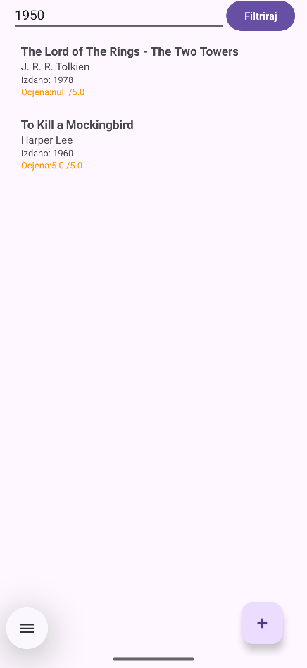
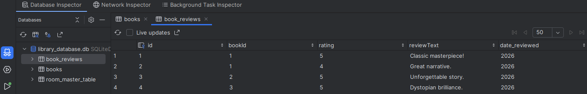

<div>

# Mobilne Aplikacije

**Nositelj**: doc. dr. sc. Nikola Tanković  
**Izvođač**: dr. sc. Robert Šajina  
**Asistent**: mag. inf. Alesandro Žužić  

**Ustanova**: Sveučilište Jurja Dobrile u Puli, Fakultet informatike u Puli

<p style="float: clear; display: flex; gap: 8px; align-items: center;" class="font-brioni text-sm whitespace-nowrap">
    </img>
    Fakultet informatike u Puli
</p>

# [8] - Spremnici podataka

**Posljednje ažurirano:** 14. siječnja 2026.

## Sadržaj
<!-- TOC -->
- [Sadržaj](#sadržaj)
- [Internal Storage](#internal-storage)
    - [Spremanje datoteke](#spremanje-datoteke)
    - [Čitanje datoteke](#čitanje-datoteke)
    - [Brisanje datoteke](#brisanje-datoteke)
    - [Rad s JSON datotekama](#rad-s-json-datotekama)
    - [Samostalni zadatak za vježbu #1](#samostalni-zadatak-za-vježbu-1)
- [External Storage](#external-storage)
    - [Spremanje datoteke](#spremanje-datoteke)
    - [Čitanje datoteke](#čitanje-datoteke)
    - [Samostalni zadatak za vježbu #2](#samostalni-zadatak-za-vježbu-2)
- [Room](#room)
    - [Room Entity](#room-entity)
    - [Room DAO](#room-dao)
    - [Room Database](#room-database)
    - [Dodavanje podataka](#dodavanje-podataka)
    - [Ažuriranje podataka](#ažuriranje-podataka)
    - [Čitanje podataka s opservacijom](#čitanje-podataka-s-opservacijom)
    - [Brisanje podataka](#brisanje-podataka)
    - [Samostalni zadatak za vježbu #3](#samostalni-zadatak-za-vježbu-3)
<!-- /TOC -->

<div class="page"></div>

## Internal Storage

`Internal Storage` predstavlja privatni prostor pohrane koji je dostupan samo aplikaciji. Podaci pohranjeni ovdje su:
- **Privatni** – nedostupni drugim aplikacijama
- **Sigurni** – zaštićeni od ostalih aplikacija
- **Automatski obrisani** – brišu se pri deinstalaciji aplikacije
- **Bez dodatnih dozvola** – nije potrebna dozvola u `AndroidManifest.xml`

**Primjeri korištenja Internal Storage:**
- Cache datoteke
- JSON datoteke s postavkama
- Privremeni podaci
- Podaci koji nisu dostupni korisniku
- Lokalne baze podataka

### Spremanje datoteke

Za spremanje datoteke koristimo `FileOutputStream` koji dobijemo pozivom `openFileOutput()`:

```java
try (FileOutputStream fos = openFileOutput("data.txt", Context.MODE_PRIVATE)) {
    fos.write("Hello World".getBytes());
} catch (IOException e) {
    Log.e("STORAGE", "Error writing file", e);
}
```

- `openFileOutput()` otvara ili kreira datoteku u Internal Storage direktoriju aplikacije
- `Context.MODE_PRIVATE` osigurava da je datoteka dostupna samo aplikaciji
- Try-with-resources blok automatski zatvara `FileOutputStream`

### Čitanje datoteke

Za čitanje datoteke koristimo `FileInputStream` koji dobijemo pozivom `openFileInput()`:

```java
try (FileInputStream fis = openFileInput("data.txt")) {
    byte[] buffer = new byte[1024];
    int bytesRead = fis.read(buffer);
    String content = new String(buffer, 0, bytesRead);
    Log.d("STORAGE", "Content: " + content);
} catch (IOException e) {
    Log.e("STORAGE", "Error reading file", e);
}
```

- `openFileInput()` otvara datoteku iz Internal Storage direktorija
- Čitamo podatke u buffer od 1024 bajta
- Pretvorimo bajt polje u String za lakšu upotrebu

### Brisanje datoteke

Za brisanje datoteke koristimo `deleteFile()`:

```java
boolean deleted = deleteFile("data.txt");
if (deleted) {
    Log.d("STORAGE", "File deleted successfully");
}
```

### Rad s JSON datotekama

JSON je popularan format za pohranu strukturiranih podataka. Android podržava rad s JSON datotekama kroz biblioteke kao što su `Gson` ili ugrađeni `JSONObject`.

**Primjer s Gson bibliotekom:**

Trebamo dodati Gson ovisnost u `build.gradle`:

```gradle
dependencies {
    ...
    implementation 'com.google.code.gson:gson:2.13.2'
}
```

**Spremanje JSON datoteke:**

`FoodItem` klasa korištena u primjerima:
```java
public class FoodItem {
    String name;
    double calories;
    public FoodItem(String name, double calories) {
        this.name = name;
        this.calories = calories;
    }
    public String getName() { return name;  }
    public double getCalories() { return calories; }
}
```

<div class="page"></div>

```java
// Kreiramo objekt koji trebamo spremiti
FoodItem food = new FoodItem("Jabuka", 95);

// Pretvaramo objekt u JSON string
Gson gson = new Gson();
String jsonString = gson.toJson(food);

// Spremamo JSON u datoteku
try (FileOutputStream fos = openFileOutput("food.json", Context.MODE_PRIVATE)) {
    fos.write(jsonString.getBytes());
    Log.d("JSON", "JSON saved: " + jsonString);
} catch (IOException e) {
    Log.e("JSON", "Error saving JSON", e);
}
```

- `Gson.toJson()` pretvara Java objekt u JSON string
- Podatke spremamo kao i obične tekstualne datoteke

**Čitanje JSON datoteke:**

```java
try (FileInputStream fis = openFileInput("food.json")) {
    byte[] buffer = new byte[1024];
    int bytesRead = fis.read(buffer);
    String jsonString = new String(buffer, 0, bytesRead);
    
    // Pretvaramo JSON string u Java objekt
    Gson gson = new Gson();
    FoodItem food = gson.fromJson(jsonString, FoodItem.class);
    
    Log.d("JSON", "Food loaded: " + food.getName() + ", " + food.getCalories());
} catch (IOException e) {
    Log.e("JSON", "Error reading JSON", e);
}
```

- `Gson.fromJson()` pretvara JSON string u Java objekt
- Trebamo specificirati klasu u koju trebamo pretvoriti

<div class="page"></div>

### Samostalni zadatak za vježbu #1

Napišite funkciju koja sprema listu objekata `FoodItem` u JSON datoteku unutar Internal Storage. Zatim napišite funkciju koja čita tu JSON datoteku i vraća listu `FoodItem` objekata. Prikažite korištenje tih funkcija s `Logcat`. `FoodItem` klasa je ista kao u gornjim primjerima.

<div style="width: fit-content; display: flex; flex-direction: column;">
    <div style="display: flex; justify-content: space-between;">
        
    </div>
    <br/>
    <p style="margin-top: -16px; width: 100%; text-align: center;"><i>Primjer rješenja zadatka #1</i></p>
</div>

## External Storage

`External Storage` predstavlja prostor pohrane dostupan korisniku i potencijalno drugim aplikacijama. Za razliku od Internal Storage, External Storage:
- **Nije privatan** – vidljiv je korisniku i može biti dostupan drugim aplikacijama
- **Nije siguran** – ne jamči sigurnost podataka
- **Nije obrisan pri deinstalaciji** – podaci ostaju nakon uklanjanja aplikacije (u većini slučajeva)
- **Zahtijeva dozvole** – na starijim verzijama Androida trebaju dozvole

**External Storage koristimo kada:**
- Korisnik treba vidjeti ili otvoriti datoteku
- Podaci trebaju biti dostupni nakon deinstalacije aplikacije
- Trebamo dijeliti datoteke s drugim aplikacijama
- Trebamo eksportirati podatke u formatu kao što su CSV ili PDF

**Primjeri korištenja External Storage:**
- Export podataka (CSV, PDF)
- Preuzimanje datoteka
- Slike i video zapisi
- Backup podataka

<div class="page"></div>

External Storage ima dva glavna tipa direktorija:

1. **App-specific direktoriji** – dostupni samo aplikaciji, ne zahtijevaju dozvole
2. **Shared direktoriji** – dostupni svim aplikacijama, trebaju dozvole

```
/storage/emulated/0/
├── Android/
│   └── data/
│       └── com.example.app/
│           └── files/
│               ├── Documents/
│               ├── Pictures/
│               └── Music/
├── Documents/
├── Pictures/
├── Music/
├── Downloads/
└── ...
```

App-specific External Storage je direktorij dostupan samo jednoj aplikaciji.

- Vidljiv je korisniku putem file explorera
- Ne zahtijeva dodatne dozvole (*od Android 8+*)
- Briše se pri deinstalaciji aplikacije
- Za export podataka, privremene datoteke i slike

### Spremanje datoteke

```java
File dir = getExternalFilesDir(Environment.DIRECTORY_DOCUMENTS);
if (dir != null && dir.exists()) {
    File file = new File(dir, "test.txt");
    try (FileOutputStream fos = new FileOutputStream(file)) {
        fos.write("Test data".getBytes());
        Log.d("STORAGE", "File saved: " + file.getAbsolutePath());
    } catch (IOException e) {
        Log.e("STORAGE", "Error saving file", e);
    }
}
```

- `getExternalFilesDir()` vraća app-specific direktorij na External Storage
- `Environment.DIRECTORY_DOCUMENTS` je konstanta za Documents mapu
- Kreiramo novu datoteku unutar tog direktorija `new File(dir, "test.txt")`
- Spremamo podatke u datoteku koristeći `FileOutputStream`

<div style="width: fit-content; display: flex; flex-direction: column;">
    <div style="display: flex; justify-content: center;">
        
    </div>
    <br/>
    <p style="margin-top: -16px; width: 100%; text-align: center;"><i>Spremanje datoteke u app-specific External Storage</i></p>
</div>

### Čitanje datoteke

```java
File dir = getExternalFilesDir(Environment.DIRECTORY_DOCUMENTS);
if (dir != null && dir.exists()) {
    File file = new File(dir, "test.txt");
    if (file.exists()) {
        try (FileInputStream fis = new FileInputStream(file)) {
            byte[] buffer = new byte[(int) file.length()];
            int bytesRead = fis.read(buffer);
            String content = new String(buffer, 0, bytesRead);
            Log.d("STORAGE", "Content: " + content);
        } catch (IOException e) {
            Log.e("STORAGE", "Error reading file", e);
        }
    }
}
```

- Provjeravamo postoji li direktorij i datoteka prije čitanja
- Koristimo `FileInputStream` za čitanje podataka iz datoteke

<div class="page"></div>

### Samostalni zadatak za vježbu #2

Napišite funkciju koja sprema listu objekata `FoodItem` u JSON datoteku unutar app-specific External Storage. Zatim napišite funkciju koja čita tu JSON datoteku i vraća listu `FoodItem` objekata. Prikažite korištenje tih funkcija s `Logcat`. `FoodItem` klasa je ista kao u gornjim primjerima.

<div style="width: fit-content; display: flex; flex-direction: column;">
    <div style="display: flex; justify-content: space-between;">
        
    </div>
    <br/>
    <p style="margin-top: -16px; width: 100%; text-align: center;"><i>Primjer rješenja zadatka #2</i></p>
</div>

<div class="page"></div>

## Room

`Room` je moderna Android biblioteka koja nudi ORM (*Object Relational Mapping*) sloj iznad **SQLite** baze. Room pojednostavljuje rad s bazom podataka i izbjegava česte greške kao što su:
- **Memory leak** Cursora
- **Boilerplate koda** za CRUD operacije
- **Compile-time security** – SQL upiti se provjeravaju tijekom kompajliranja
- **LiveData/Flow integracija** – automatska opservacija promjena u bazi

Room se sastoji od tri glavne komponente:

1. **Entity** – predstavlja tablicu u bazi podataka
2. **DAO** (*Data Access Object*) – definira operacije nad tablicom
3. **Database** – apstraktna klasa koja povezuje sve komponente

> Kod implementacije koristimo `room.common` i `room.runtime` biblioteke kada ih importamo

<div class="page"></div>

### Room Entity

`Entity` je klasa koja predstavlja tablicu u bazi. Mapiramo je s pomoću `@Entity` anotacije:

```java
@Entity(tableName = "food_items")
public class FoodItem {
    @PrimaryKey(autoGenerate = true)
    public int id;
    
    @NonNull 
    public String name;
    
    public int calories;
    
    @ColumnInfo(name = "date_added")
    public String dateAdded;
    
    public FoodItem(String name, int calories, String dateAdded) {
        this.name = name; 
        this.calories = calories;
        this.dateAdded = dateAdded;
    }
}
```

- `@Entity` definira klasu kao tablicu
- `@PrimaryKey` označava primarni ključ
- `autoGenerate = true` automatski dodjeluje ID
- `@NonNull` osigurava da stupac ne smije biti NULL
- `@ColumnInfo` omogućuje promjenu imena stupca u bazi

### Room DAO

DAO je sučelje koje definira operacije nad tablicom. Room automatski implementira te metode:

```java
@Dao
public interface FoodDao {
    
    @Insert
    void insert(FoodItem foodItem);
    
    @Update
    void update(FoodItem foodItem);
    
    @Delete
    void delete(FoodItem foodItem);
    
    @Query("SELECT * FROM food_items ORDER BY name ASC")
    LiveData<List<FoodItem>> getAllFood();
    
    @Query("SELECT * FROM food_items WHERE id = :foodId")
    LiveData<FoodItem> getFoodById(int foodId);
    
    @Query("SELECT * FROM food_items WHERE calories > :minCalories")
    LiveData<List<FoodItem>> getFoodByCalories(int minCalories);
    
    @Query("DELETE FROM food_items WHERE id = :foodId")
    void deleteFoodById(int foodId);
}
```

- `@Insert` automatski generira insert SQL
- `@Update` automatski generira update SQL
- `@Delete` automatski generira delete SQL
- `@Query` omogućuje prilagođene SQL upite
- `LiveData<List<T>>` automatski osigurava promjene u UI kada se baza promijeni

### Room Database

Database klasa je apstraktna klasa koja nasljeđuje `RoomDatabase` i povezuje sve Entity i DAO:

```java
@Database(entities = {FoodItem.class}, version = 1)
public abstract class AppDatabase extends RoomDatabase {
    public abstract FoodDao foodDao();
}
```

- `@Database` defini sve Entity-je koje su dio baze
- `version` se koristi za migracije (kao u SQLiteOpenHelper)
- Apstraktne metode vraćaju instance DAO-a

Room bazu inicijaliziramo s pomoću `Room.databaseBuilder()`:

```java
AppDatabase db = Room.databaseBuilder(
    getApplicationContext(),
    AppDatabase.class,
    "food_database.db"
).build();

FoodDao dao = db.foodDao();
```

- `databaseBuilder()` kreira instancu baze
- Trebamo proslijediti kontekst, klasu baze i naziv datoteke
- `.build()` kreira instancu

<div class="page"></div>

> Trebamo koristiti Singleton pattern kako bi se baza učitala samo jednom:

```java
public class DatabaseProvider {
    private static AppDatabase instance;

    public static AppDatabase getInstance(Context context) {
        if (instance == null) {
            instance = Room.databaseBuilder(
                context,
                AppDatabase.class,
                "food_database.db"
            ).build();
        }
        return instance;
    }
}
```

### Dodavanje podataka

```java
FoodItem apple = new FoodItem("Apple", 95, "2026-01-14");
new Thread(() -> {
    AppDatabase db = DatabaseProvider.getInstance(context);
    db.foodDao().insert(apple);
    Log.d("ROOM", "Food inserted");
}).start();
```

- DB operacije trebaju biti na background thread-u
- Koristimo novi Thread

### Ažuriranje podataka

```java
FoodItem updatedFood = new FoodItem("Updated Apple", 100, "2026-01-14");
updatedFood.id = 1;

new Thread(() -> {
    AppDatabase db = DatabaseProvider.getInstance(context);
    db.foodDao().update(updatedFood);
    Log.d("ROOM", "Food updated");
}).start();
```

Dok je aplikacija pokrenuta, možemo vidjeti kreiranu bazu u koristeći `App Inspection` alat u Android Studiu tako da odemo na `View > Tool Windows > App Inspection`, zatim odaberemo `Database Inspector`:

<div style="width: fit-content; display: flex; flex-direction: column;">
    <div style="display: flex; justify-content: space-between;">
        
    </div>
    <br/>
    <p style="margin-top: -16px; width: 100%; text-align: center;"><i>Database Inspector</i></p>
</div>

### Čitanje podataka s opservacijom

```java
AppDatabase db = DatabaseProvider.getInstance(context);
db.foodDao().getAllFood().observe(this, foodList -> {
    Log.d("ROOM", "Foods updated: " + foodList.size());
});
```

- `observe()` automatski se poziva kada se baza promijeni

> observe() se ne može koristiti unutar Thread-a

### Brisanje podataka

```java
new Thread(() -> {
    AppDatabase db = DatabaseProvider.getInstance(context);
    db.foodDao().deleteFoodById(1);
    Log.d("ROOM", "Food deleted");
}).start();
```

<div class="page"></div>

### Samostalni zadatak za vježbu #3

Kreirajte Android aplikaciju za upravljanje **personalnom knjižnicom** s UI-jem i Room bazom podataka. Aplikacija trebala biti sadržavati:

**Entity klase:**
- `Book` – s poljima: `id`, `title`, `author`, `isbn`, `pages`, `publishedYear`, `dateAdded`
- `BookReview` – s poljima: `id`, `bookId`, `rating` (1-5), `reviewText`, `dateReviewed`

**Funkcionalnosti:**
1. **Dodavanje knjige** – forma s poljem za naslov, autora, ISBN, broj stranica i godinu izdanja
2. **Prikaz liste knjiga** – RecyclerView s knjigama sortiranim po naslovu
3. **Filtriranje** – prikaz samo knjiga izdanih nakon određene godine
4. **Dodavanje recenzije** – forma koja omogućuje dodavanje ocjene (1-5) i teksta recenzije za odabranu knjigu
5. **Prikaz recenzija** – list recenzija za odabranu knjigu s prosječnom ocjenom
6. **Brisanje** – mogućnost brisanja knjige i njenih recenzija iz baze

**DAO operacije trebaju biti:**
- Insert za knjige i recenzije
- Delete s kaskadnim brisanjem recenzija
- Query za sve knjige sortirane po naslovu
- Query sve knjige iznad određene godine
- Query recenzije za određenu knjigu
- Query prosječnu ocjenu za knjigu

**UI zahtjevi:**
- Activity/Fragment za prikaz lista
- Dialog/Activity/Fragment za dodavanje nove knjige
- Dialog/Activity/Fragment za dodavanje recenzije
- Button za dodavanje knjige
- Prikaz prosječne ocjene ispod svake knjige

<div style="width: fit-content; display: flex; flex-direction: column;">
    <div style="display: flex; justify-content: space-between;">
        
        
        
        
    </div>
    
    
    <br/>
    <p style="margin-top: -16px; width: 100%; text-align: center;"><i>Primjer rješenja zadatka #3</i></p>
</div>


</div>